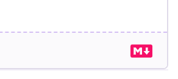

# Markdown Editor

Text boxes that have the _Markdown_ logo at the bottom-right can be used to add
rich formatting to what you write.



## What is Markdown?

Markdown is a method to add styling for your text on the web. You can style
your text by including special characters to indicate whether words should be
bold or italic, add numbers lists or unordered lists, add links to other
web-pages, embed images, and much more.

## How do I use it?

You'll find examples of the all the features of Markdown below. In all
examples, we'll first display the _raw_ Markdown text, followed by how it'll
look after it is converted to _styled_ content for display on the web.

### Text

---

```markdown
This is a paragraph. A single
line-break will not end the paragraph.

You need two line-breaks for that. Some words **bold** and others
can be _italicized_. You can mark letters or a word as super^script^,
or sub~script~. You can also link to other webpages - for example,
here's [a link to Wikipedia](https://www.wikipedia.org/).
```

This is a paragraph. A single
line-break will not end the paragraph.

You need two line-breaks for that. Some words **bold** and others
can be _italicized_. You can mark letters or a word as super^script^,
or sub~script~. You can also link to other webpages - for example,
here's [a link to Wikipedia](https://www.wikipedia.org/).

---

#### Aligning text

You can also align blocks of text:

---

```markdown
=-- Text aligned to the _left_ (**default**).

-=- Text that is _center-aligned_.

--= Text aligned to the _right_.
```

=-- Text aligned to the _left_ (**default**).

-=- Text that is _center-aligned_.

--= Text aligned to the _right_.

---

### Lists

Lists can be ordered (numbered), or unordered:

---

```markdown
1. This is the first item in an ordered list.
2. These begin by a number followed by a period.
3. You can have line-breaks within a single list
   item; just make sure that the continuation text is aligned
   correctly with the text above, like it's done here.
4. You can also _nest_ lists - i.e., have one list within another:
   1. Here's a nested list...
   2. ...and a second item in the nested list.
   3. Notice how the numbering doesn't matter. Mistakes in numbering
      will be fixed when it's displayed.

- You can also have _unordered_ lists. These begin with the _dash_, or the
  _asterisk_ character.
- You can mix and match ordered (numbered) and unordered lists.
```

1. This is the first item in an ordered list.
2. These begin by a number followed by a period.
3. You can have line-breaks within a single list
   item; just make sure that the continuation text is aligned
   correctly with the text above, like it's done here.
4. You can also _nest_ lists - i.e., have one list within another:
   1. Here's a nested list...
   2. ...and a second item in the nested list.
   3. Notice how the numbering doesn't matter. Mistakes in numbering
      will be fixed when it's displayed.

- You can also have _unordered_ lists. These begin with the _dash_, or the
  _asterisk_ character.
- You can mix and match ordered (numbered) and unordered lists.

---

### Images

Images are very similar to _links_. They start with an exclamation mark, hold
[alternative text](https://en.wikipedia.org/wiki/Wikipedia:Manual_of_Style/Accessibility/Alternative_text_for_images)
in square brackets, and are followed by the URL to an image in parenthesis. For example:

---

```markdown

```


---

You can also control the size of the image.

---

```markdown


```


---

The dimensions are in the format: `WxH`. The height is optional, and is used
only to assign vertical space for the image before it's loaded. The image will
always fit within the specified width, and will maintain its proportions
regardless of the specified height. The width can also be a percentage.

### Headings

You can have up to six levels of headings, marked by a number of _hash_
characters before the heading text:

---

```markdown
# 1^st^ level heading

Use the 1^st^ level heading sparingly, if ever; you should only have one of
these in a page if you opt to use them.

Don't forget the space after the `#` character.

## 2^nd^ Level Heading

Here's the second-level heading. You should mostly be using the 2nd, 3rd, and
4th level headings in your text.

### 3^rd^ Level Heading

#### 4^th^ Level Heading

##### 5^th^ Level Heading

###### 6^th^ Level Heading
```

# 1^st^ level heading

Use the 1^st^ level heading sparingly, if ever; you should only have one of
these in a page if you opt to use them.

Don't forget the space after the `#` character.

## 2^nd^ Level Heading

Here's the second-level heading. You should mostly be using the 2nd, 3rd, and
4th level headings in your text.

### 3^rd^ Level Heading

#### 4^th^ Level Heading

##### 5^th^ Level Heading

###### 6^th^ Level Heading

---

### Block-quotes

You can make certain blocks of text _stand out_, for example, when quoting
from another source:

---

```markdown
> “Learning is a treasure that will follow its owner everywhere.”
>
> \- Chinese Proverb
```

> “Learning is a treasure that will follow its owner everywhere.”
>
> \- Chinese Proverb

---

Note how there's a _forward-slash_ before the _dash_ character. That stops the
line from being converted to a list.

### Tables

---

```markdown
| Column 1 Heading                            | Column 2 Heading      |
| ------------------------------------------- | --------------------- |
| First value in row 1                        | Second value in row 1 |
| First value in row 2                        | Second value in row 2 |
| You can also _combine_ rows.                |                       |
| You can also style text `inside` the table. |                       |
```

| Column 1 Heading                            | Column 2 Heading      |
| ------------------------------------------- | --------------------- |
| First value in row 1                        | Second value in row 1 |
| First value in row 2                        | Second value in row 2 |
| You can also _combine_ rows                 |                       |
| You can also style text `inside` the table. |                       |

---

### Embedding videos

You can embed videos from YouTube and Vimeo easily:

```markdown
@[youtube](il0L60hfVEk)

@[vimeo](452610846)
```

You can also use the full URL to a video instead of just the video ID. For example:

```markdown
@[vimeo](https://vimeo.com/452610846)
```

@[vimeo](https://vimeo.com/452610846)

### Mathematical expressions

You can use $\KaTeX$ to write mathematical expressions. To learn how to write
KaTeX, please check [their official documentation](https://katex.org/docs/supported.html).

---

```tex
An expression as a block:

$$
\begin{CD}
   A @>a>> B \\
@VbVV @AAcA \\
   C @= D
\end{CD}
$$

An inline expression: $c = \pm\sqrt{a^2 + b^2}$
```

An expression as a block:

$$
\begin{CD}
   A @>a>> B \\
@VbVV @AAcA \\
   C @= D
\end{CD}
$$

An inline expression: $c = \pm\sqrt{a^2 + b^2}$

---

### Inline code

There are a couple of ways to style _code_ with our Markdown editor. You can
write code inline by wrapping it using a single _backtick_ character:

---

```markdown
This is a line that has some `inline code` within it.
```

This is a line that has some `inline code` within it.

---

### Fenced code blocks

You can also have large multi-line code-blocks by wrapping them in (at-least)
three backticks.

> _Psst..._ we've been using this feature all along in this document!

---

````markdown
```
This is some
  text
    that is pre-formatted.
```
````

```
This is some
  text
    that is pre-formatted.
```

---

If you would like to enable syntax highlighting, mention the name of the
language after the first set of backticks:

---

````markdown
```javascript
let rec hanoi = (n, a, b, c) =>
  if (n > 0) {
    hanoi(n - 1, a, c, b);
    Js.log({j|Move disk from pole $a to pole $b|j});
    hanoi(n - 1, c, b, a)
  };

hanoi(4, 1, 2, 3);
```
````

```javascript
const hanoi = (n, a, b, c) => {
  if (n > 0) {
    hanoi(n - 1, a, c, b);
    console.log("Move disk " + n + " from " + a + " to " + b);
    hanoi(n - 1, c, b, a);
  }
};

hanoi(4, 1, 2, 3);
```

---

Supported languages are noted in a separate section below.

### _Diff_ code blocks

You can also highlight changes in _diff_-style output.

---

````
```diff
@@ -4,6 +4,5 @@
-    let foo = bar.baz([1, 2, 3]);
-    foo = foo + 1;
+    const foo = bar.baz([1, 2, 3]) + 1;
     console.log(`foo: ${foo}`);
```
````

```diff
@@ -4,6 +4,5 @@
-    let foo = bar.baz([1, 2, 3]);
-    foo = foo + 1;
+    const foo = bar.baz([1, 2, 3]) + 1;
     console.log(`foo: ${foo}`);
```

---

The `diff` keyword can also be written as `diff-highlight`, `diff-LANGUAGE`,
or `diff-LANGUAGE-highlight` . The first of these will enable highlighting of
differing lines, the second will enable syntax highlighting based on specified
language, and the third will enable both features. For example:

---

````
```diff-javascript-highlight
@@ -4,6 +4,5 @@
-    let foo = bar.baz([1, 2, 3]);
-    foo = foo + 1;
+    const foo = bar.baz([1, 2, 3]) + 1;
     console.log(`foo: ${foo}`);
```
````

```diff-javascript-highlight
@@ -4,6 +4,5 @@
-    let foo = bar.baz([1, 2, 3]);
-    foo = foo + 1;
+    const foo = bar.baz([1, 2, 3]) + 1;
     console.log(`foo: ${foo}`);
```

---

## Supported Languages

This is the comprehensive list of languages and scripts that we support syntax
highlighting on, within fenced code-blocks.

- `javascript` (`js`)
- `jsx`
- `json` (`webmanifest`)
- `markup` (`html`, `xml`, `svg`, `mathml`)
- `css`
- `scss`
- `sql`
- `python` (`py`)
- `java`
- `bash` (`shell`)
- `csharp` (`cs`, `dotnet`)
- `php`
- `typescript` (`ts`)
- `tsx`
- `cpp`
- `c`
- `go`
- `kotlin` (`kt`, `kts`)
- `ruby` (`rb`)
- `erb`
- `reason`
- `markdown` (`md`)
- `yaml` (`yml`)
- `latex` (`tex`, `context`)
