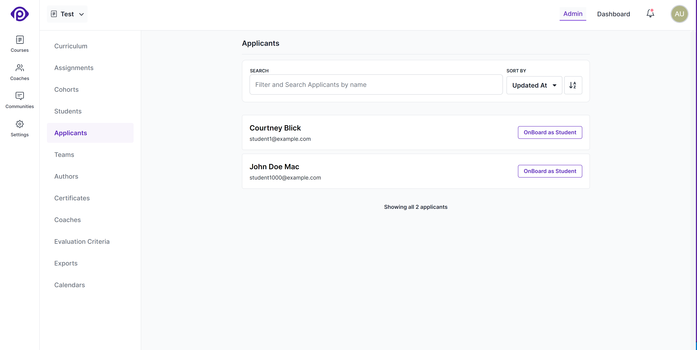

Pupilfirst allows you to collect applications for your courses, and review them before adding students to a course. This is useful if you want to restrict access to a course to a select group of students, or if you want to collect additional information from students before they join a course.

## Setting up an application process

You can enable applicant data processing on a course where [public sign-ups are enabled](/users/courses#creating-courses). If the option to _process applicant data_ (found alongside the _public sign-up_ option) isn't also enabled, people who sign-up to your course would be enrolled as students immediately.

### Set an applicant redirect URL

Enabling the _process applicant data_ option will require you to set a custom URL to which applicants can be redirected after their email address is verified by the LMS.

Redirecting students a custom URL can be used to do things like:

1. Have students fill a form with additional questions.
2. Accept payment before gaining access to the course.
3. Simply show a message asking students to wait while their information is reviewed.

You can add several properties related to applicants to the processing URL that they are redirected to after email verification:

- The unique ID of the course - `${course_id}`
- The unique ID of the applicant - `${applicant_id}`
- The name of the applicant - `${name}`
- The email address of the applicant - `${email}`

When placed in the processing URL, Pupilfirst LMS will replace these special keywords with their actual values when the applicant clicks the link in the verification email.

Here's an example processing URL that includes all the available properties:

```
https://paymentgateway.com/process?name=${name}&email=${email}&course_id=${course_id}&applicant_id=${applicant_id}
```

### View and process applicant data

After the student has been redirected to the above URL, the information collected by the LMS during the sign-up process can be viewed by clicking on _Applicants_ from the course's sub-menu.



Click the _Onboard as Student_ button to review the applicant's information before adding them as a student in the course. This will open up a form that allows you to edit additional information about the student before enrolling them to the course:

**Title** (optional): The title of the student. Feel free to leave this blank - it'll default to _Student_.

**Affiliation** (optional): The organization to which the student belongs. This field is also optional.

The _title_ and _affiliation_ fields are displayed across the LMS to better identify students.

**Tags** (optional): Tags are keywords or strings to associate with the list of students that you're adding, and can be used to quickly filter the list of students in a course. You can start typing and pick from the suggested list of tags or create new ones.

**Notify students**: Use this checkbox to enable or disable onboarding email notification for the newly enrolled students.

<details>
   <summary>Which cohort will they be added to?</summary>
   <div>
      All applicants will be added as students to <a href="/users/courses#default-cohort">the default cohort</a> of the course.
   </div>
</details>
