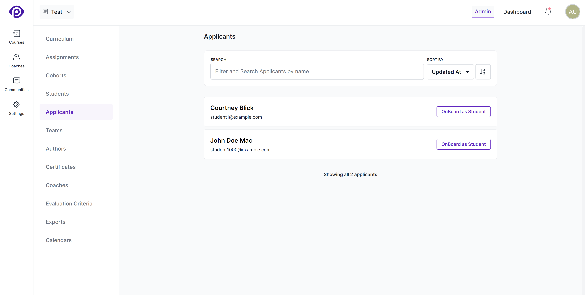

Pupilfirst allows you to collect applications for your courses, and review them before adding students to a course. This is useful if you want to restrict access to a course to a select group of students, or if you want to collect additional information from students before they join a course.

## Enabling applications

To enable applications for a course, The course should have [public signups enabled](/users/courses#creating-courses) and the [applicant processing](/users/courses#creating-courses) option should be enabled.

## Viewing the list of applicants

To view the list of applicants that are waiting to be processed, click on the _Applicants_ rom the course's sub-menu.

## Onboarding applicants

Click on the _onBoard as Student_ button to add the applicant as a student in the course. This will open up a form that allows you to enter the student's details, and add them to the course.

The following are the fields that you can fill in before adding the student to the course:

**Title** (optional): The title of the student. Feel free to leave this blank - it'll default to _Student_.

**Affiliation** (optional): The organization to which the student belongs. This field is also optional.

The _title_ and _affiliation_ fields are used across the platform to better identify students.

**Tags** (optional): Tags are keywords or strings to associate with the list of students that you're adding, and can be used to quickly filter the list of students in a course. You can start typing and pick from the suggested list of tags or create new ones.

**Notify students**: Use this checkbox to enable or disable onboarding email notification for the newly added students.

> **Note**: All the applicants that are onboarded to a course will be added to the [default cohort](/users/courses#default-cohort) of the course.
