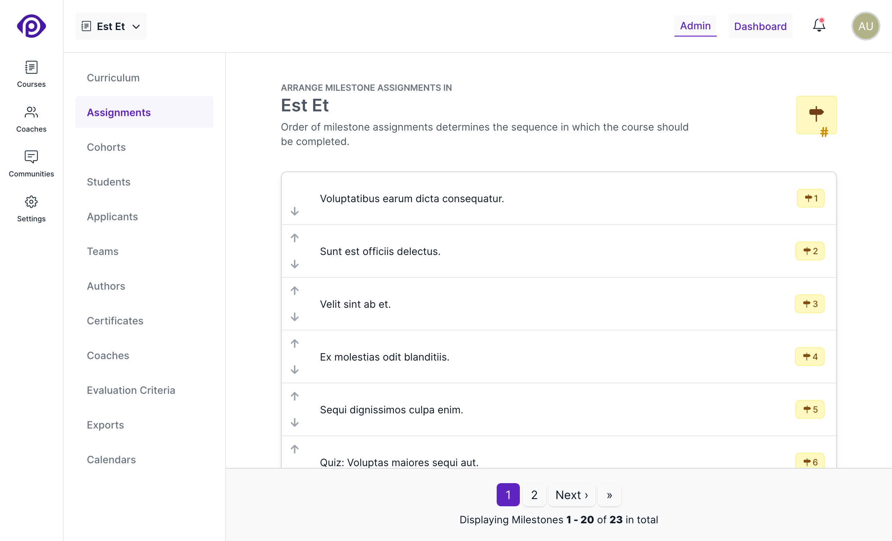

On the _Curriculum_ Page, once you've created milestone assignments, they can be easily organised on the _Assignments_ page. This milestone ordering feature gives you the ability to change the sequence in which these targets are listed in multiple places, including the student report and the review interface for the coaches.

It's important to note that this does _not_ affect the order in which students complete these assignments; that can be done through the use of [assignment prerequisites](/users/curriculum_editor#setting-the-method-of-completion).

