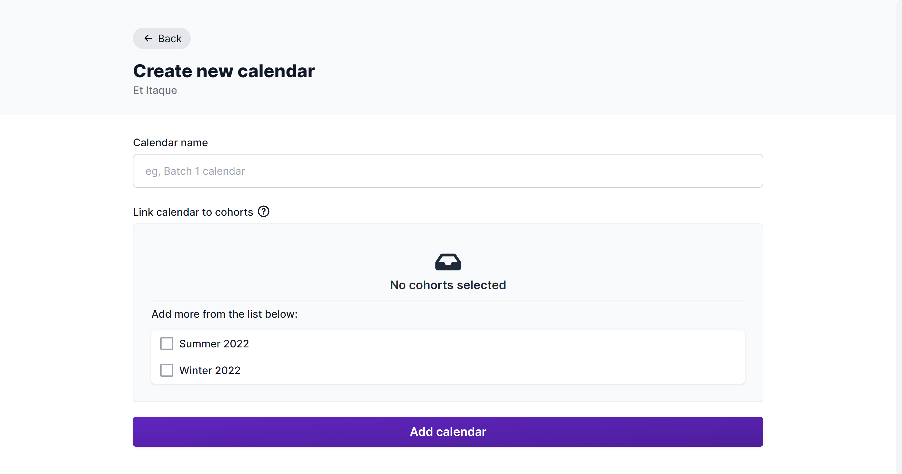
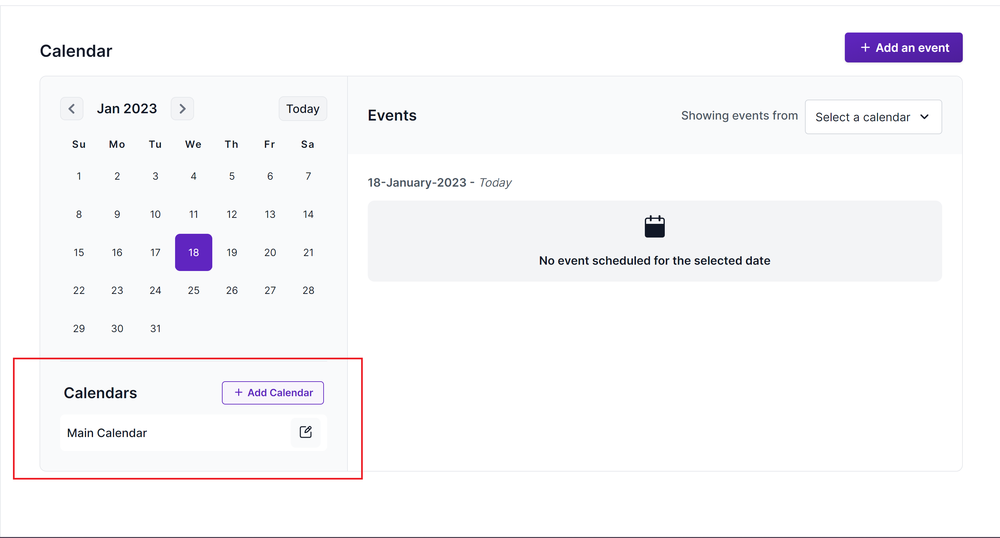
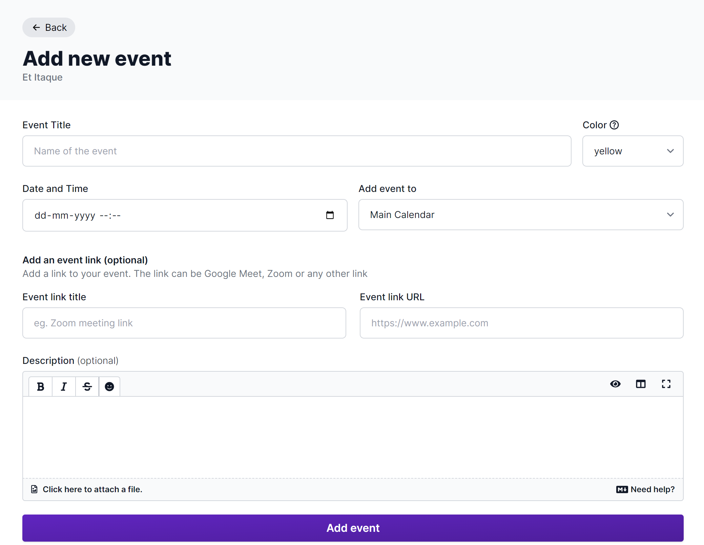
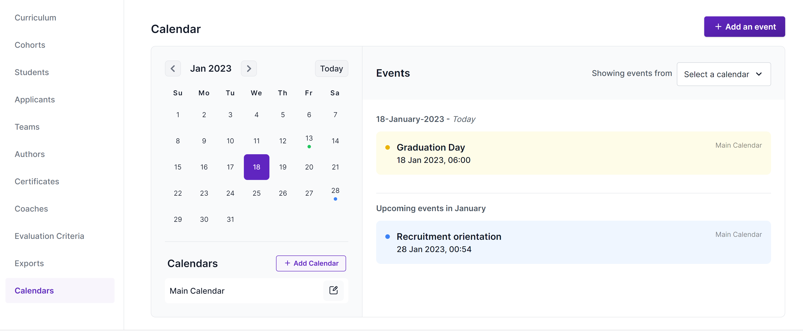
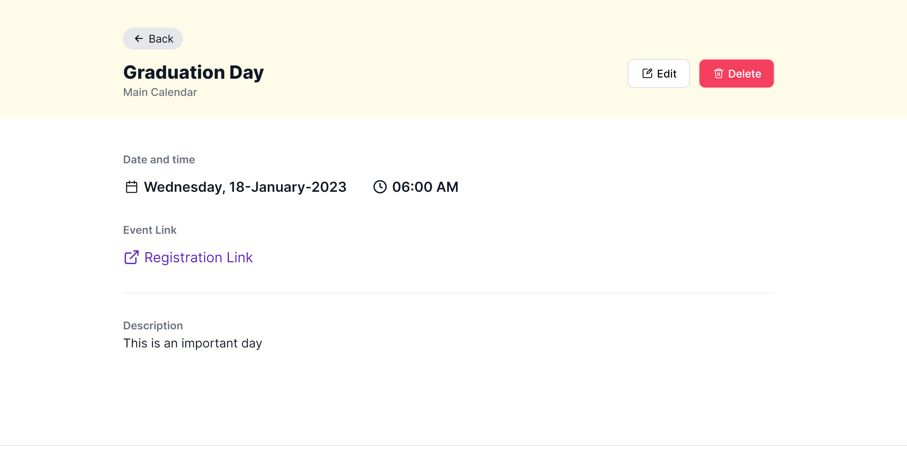
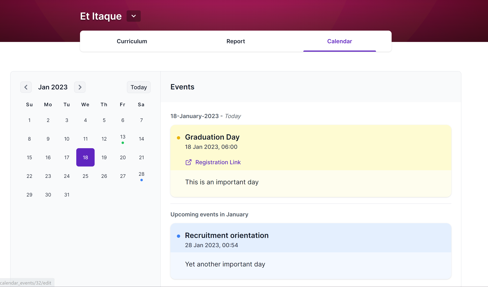

You will often want to schedule course events or keep your students informed of important dates in the course schedule. Pupilfirst lets you create a calendar for each course, and add events to it.

## Creating a new calendar

To create a new calendar, use the _Add Calendar_ button from the _Calendars_ page inside a course from your school admin. This will open a form where you can enter the name of the calendar, and link it to specific cohorts if necessary. All the events that you add to this calendar will be visible to students in these specific cohorts. If a calendar is not linked to any cohorts, it will be visible to all students in the course.

## Editing a calendar

To edit a calendar, click the edit icon on any of the calendars listed on the calendars index as show below. This will open a form where you can edit the name of the calendar, and link it to specific cohorts if necessary.

## Creating events for a calendar

To create events for a calendar, click the _Add Event_ button on the calendar's page. This will open a form where you can enter the name of the event, and the date and time of the event. You need to select the calendar to which this event belongs to and a color for the event. The colors help you categorize events in the calendar. There are optional fields which include a description, an event link and a title for the event link.

## Navigating the calendar

The calendar index has a date picker which lets you move to a specific date. You can also use the _Previous_ and _Next_ buttons to move to the previous and next months respectively. The calendar also has a _Today_ button which takes you to the current month. The days with events will be having dots on them. Clicking on a day with an event will take you to the events for that day. The upcoming events for the month will be listed below the events for the day.

## Editing and deleting events

To edit or delete and event click on the event on the calendar index. This will take you to the event details page. On this page you can edit the event details and delete the event using the _Edit_ and _Delete_ buttons respectively. The edit button will open a form where you can edit the event details. The delete button will open a confirmation dialog where you can confirm the deletion of the event.

## Calendar interface for students and coaches

Students and coaches will see the calendar interface when they click on the _Calendars_ link in the course navigation bar besides curriculum. The calendar interface for students and coaches has a similar date picker to navigate accross dates. The dates with events will be having dots on them. Clicking on a day with an event will take you to the events for that day. The upcoming events for the month will be listed below the events for the day. Only the events that are associated with the student's cohort will be visible to the student. The events that are part of calendars that are not linked to any cohorts will be visible to all students and coaches.

