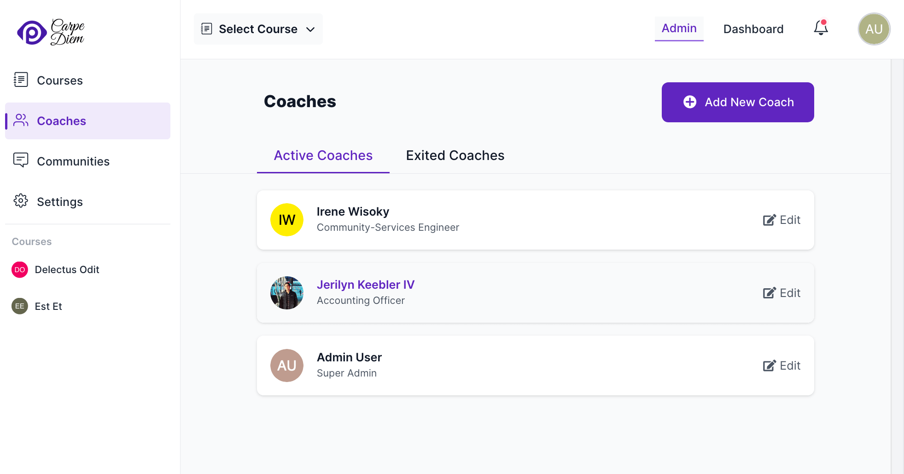
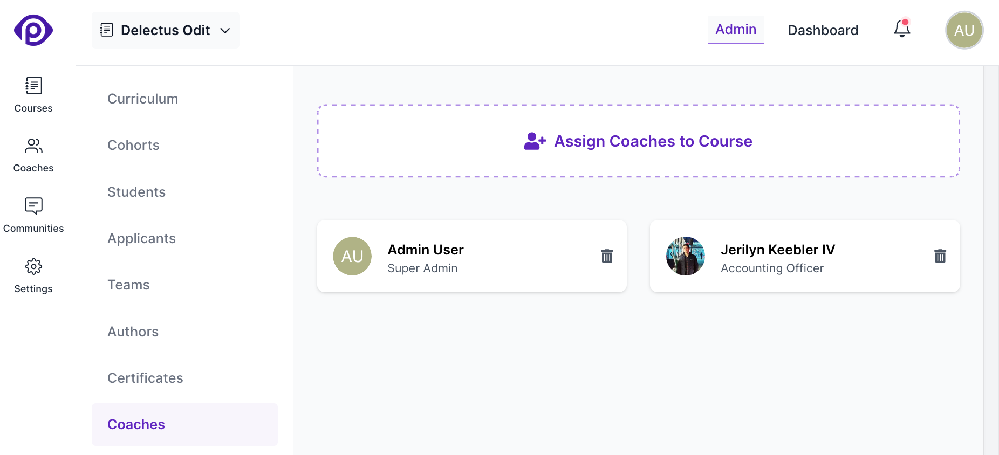

Pupilfirst enables quick and efficient review of task submissions by students, and to share feedback and create a conversation around what students have learned from a course. Coaches are users who make this possible.

1. Coaches are users who can review submissions from students.
2. Coaches also have access to all communities in a school.

## Adding and editing coaches

Coaches can be added from the coaches page, which is linked on the main navigation bar of the school administration interface.

You can add new coaches using the _Add New Coach_ option, and edit them by clicking on the name on this list. Coaches have a few additional properties unique to them:

**Connect Link**: When a coach is publicly listed, this link will also be displayed on the `/coaches` page. This link can be used to allow students to connect with a coach outside the platform, via tools such as _Calendly_.

**Should the coach profile be public?**: If this option is turned on for at least one coach, it will enable the public coaches index page at the `/coaches` path on your school. This page will list coaches who have been marked public using this setting.

**Coach Status**: To distinguish coaches who are no longer working with the school, you can assign them the status of _exited_. Feedback and messages from these coaches are preserved, but they no longer have access to coach-specific features.

## Assigning coaches to students

Once a coach has been added to a school, they can immediately access all communities. However, to review submissions from students, they must be assigned to a cohort of a course.

### Assigning coaches to cohorts

To assign a coach to cohorts of a course, head to the _Coaches_ sub-menu inside a course:

This page lists all coaches who have been assigned to different cohorts in the course. To add a new coach, click on the _Assign Coaches to Course_ button. This will open a form that allows you to select coaches from the list of all coaches in the school and select the cohorts that they should be assigned to.

Coaches will then be able to review submissions exclusively from the students within the cohorts to which they have been assigned.

### Assigning personal coaches to students

To assign a personal coach to a student, head to the [students](/users/students#editing-student-details) tab inside a course and click on a student to edit their details. This will open a form which has a field titled _Personal Coaches_, which allows you to select coaches from the list of all coaches in the course.

Make sure that the _Personal Coaches_ selected for a student are also assigned to the cohorts that the student is a part of.

This makes a few changes across Pupilfirst:

1. The list of [submissions to review](/users/reviewing_submissions) can now be filtered by selecting a _Personal Coach_.
2. When viewing the details of a submission, the directly assigned coaches are listed at the top.
3. The assigned coaches are listed on the coach overlay, course report, and the student report pages.

  
Having multiple coaches to handle reviewing of submissions can come in really handy at times.

  

  This allows coaches to do something as simple as take a few days off, asking a peer to take care of their students. If students are directly assigned, then the filtering functions that are available in the coach's review interface and students
  list makes finding applicable submissions and students simple.
  

## Coach overlay

To view _coach overlay_ click on a coach card on the coaches page. This will open an overlay that displays the following details:

1. Name and email address of the coach.
2. Number of reviewed submissions by the coach in that course.
3. Number of pending submissions to be reviewed from students assigned to the coach.
4. Students assigned to the coach.
5. Cohorts assigned to the coach.

In this overlay, you can also add or remove the cohorts assigned and remove students assigned to coach.

## Deleting coaches from a course

To remove a coach from a course, head to the _Coaches_ sub-menu inside a course, and click on the _delete_ icon on the coach card that you want to remove. This will remove the coach from the course, and they will no longer be able to review submissions from students in the course but all the feedback and messages from the coach will be preserved.

This will not delete the coach from the school. They will still be able to access all communities in the school.
