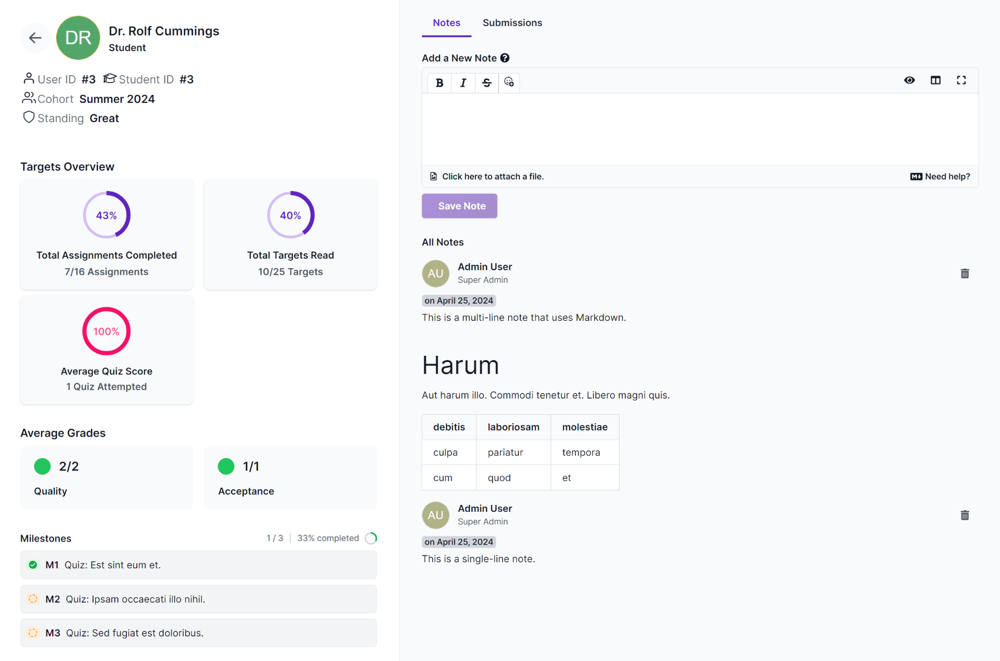

Coaches have access to the _Cohorts_ tab that lists all course cohorts that they have been enrolled in as a coach. School admins also have access to this tab, and they can view every cohort.

If you have more than a handful of students, keeping track of them - how far they've progressed in the course, how well they're doing, and what issues they've had during their time - can be daunting. Pupilfirst sets up a few simple interfaces to make these checks easier.

Coaches can track the progress of the student cohort wise by visiting the link to a particular cohort in the page above.

The _Overview_ tab shows the overall course progress statistics for the cohort. This includes the total students, the number of students who have completed the course, and the student wise distribution of milestones completed.

The _Students_ tab shows the list of students in the cohort, and you can filter this list by the student's name, email, milestone completion status, milestone pending status and course completion status.

## Detailed report

To get a detailed look at a student's progress, you can click on an entry to open up a report for that student.

The left sidebar shows all available details about the student. Top to bottom, these are:

1. Personal details, user ID, student ID, cohort name, their current standing with respect to school's Code of Conduct policy and any affiliation.
2. If the access to the course is ended for the student, it will display the date when the access was ended.
3. The total assignments they've completed, total targets read and their average score in your quizzes.
4. The average grades that they received for reviewed submissions, grouped by each of the evaluation criteria that you've set up.
5. Their team members, if any.
6. Their status of milestones in the course.
7. Coaches assigned to them, if any.

The right-side of the report contains two tabs: the coach's notes about the student, and a list of non archived submissions that the student has made.

## Grading should be objective

Assuming that your grading scale, and your review process is objective, you can use these average grades as an indicator of how well they're performing in your course.

In isolation, these value of these numbers is questionable, but it can be extremely useful when comparing the performance of students, or comparing their graded performance to _your_ expectations.

However, it's very difficult (if not impossible) to eliminate subjectivity from the review process, so these numbers should always be used with care. When possible, use of these metrics should be backed up by other measures such as coach's notes.

## Keep notes on students

During your interactions with a student, or while reviewing their submissions, you may notice that a student is particularly weak (or strong) at something. At this point, it might make sense to write a note about it.

Our memory is fallible, so it's wise to leave notes on the student's page which you and other coaches can refer to, later on for a a quick recap, and to help guide future interactions with the student.

School admins can view all the coach notes, but they cannot add a note to a student's profile unless they have been enrolled to that cohort as a coach.
