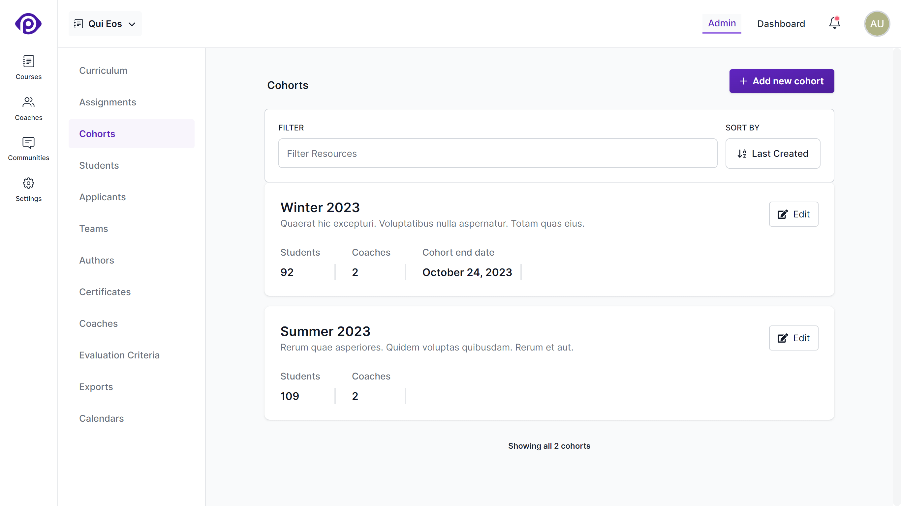

Cohorts in Pupilfirst allow you to group students who are taking a course at the same time. This feature is designed to provide a more organized and streamlined approach to managing students, especially when running multiple instances of a course simultaneously.

Courses can contain any number of cohorts. To see the cohorts in a course, first select the course from the main admin navigation bar, then pick the _Cohorts_ option from the course's sub-menu.

The cohorts page lists all the cohorts in the course, along with the number of students in each cohort. You can also see the end date of each cohort if it has been set. The number of coaches assigned to each cohort is also displayed.

## Creating cohorts

To create a new cohort, click the _Add New Cohort_ button at the top-right of the list. The form that pops up will ask you for a few details:

**Cohort name**: The name of the cohort.

**Cohort Description**: This short description about the cohort.

**Cohort end date** (optional): In general, cohorts will always have an end date, we made it optional to allow unlimited access. If set, the course will be marked as _ended_ for the cohort on this date. Students will retain preview access to the course, and their own submissions, but they will not be able to make any new submissions or mark targets as read. We recommend setting an end date if possible as a good practice.

## Editing cohorts

To edit a cohort's details, click on the _edit_ button located on the card displaying the cohort name and other information. The form used for editing the cohort is identical to the one you used during its creation.

## Cohort actions

In addition to editing a cohort's details, you can switch to the _Actions_ tab which lists the actions that you can take on a cohort:

**Merge one cohort into another cohort**

Merging cohorts will move all students from the selected cohort to the target cohort. This action can be used to delete unnecessary cohorts. This action cannot be undone.

Pick the cohort that you want this cohort to be merged into from the _Pick a Cohort_ dropdown, and click the _Merge and delete_ button.
