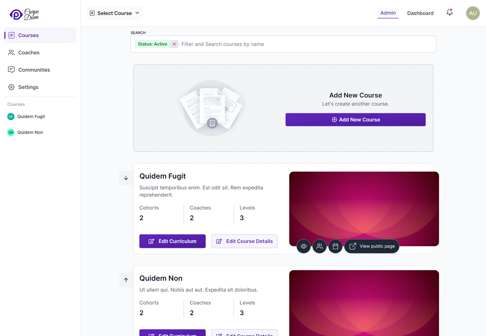
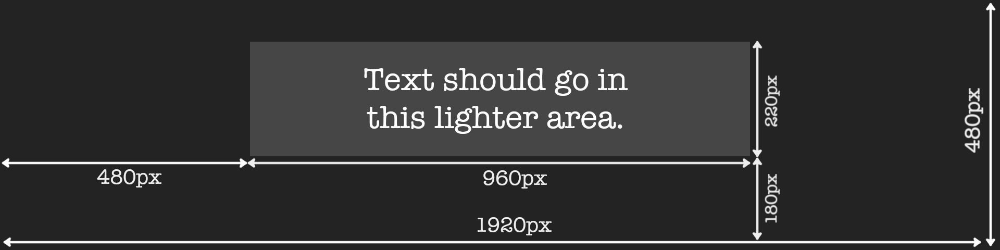

Courses hold your content and can have any number of students enrolled, with coaches to guide their path.

## Creating courses

To create a new course, head to the Courses menu from the school administration interface's navigation bar, and click the _Add New Course_ button on course creation card.



The form that pops up will ask you for a few details:

**Course name**: The name of the course, that will publicly displayed.

**Course description**: This short description will be displayed on the course's public page.

**About**: This is a markdown field - you can use this to add descriptive text about your course. This will be displayed on the course's public page.

**Progression Behavior**: This setting controls how students are allowed to progress in your course. This setting only applies if your course contains targets that require your students to submit work for review. There are two possible options, which are described in detail below.

**Feature course in school homepage?**: If enabled, the course will be displayed on the list of featured courses on your school's homepage, along with a link to the course's details page (which includes the content of the _about_ field).

**Enable public signup for this course?**: If enabled, members of the public will be able to sign up for your course.

**Do you want to process applicant information before enrolling them?**: If enabled, applicants will be redirected to a URL of your choice for further processing, after verifying their email address. [This URL can be customized](#customizing-the-processing-url) to include information about the applicant.

<details>
   <summary>You can use this processing feature to onboard students after approval!</summary>
   <div>
      Applicants will not be added as a students until you manually approve them from the <em>Applicants</em> page. This feature could be used for setting up a payments flow for the course.
   </div>
</details>

**Course Highlights**: If set, a highlights section will be shown on the course's public page. You can use this session to highlight the core features of the course.

**Allow public to view course curriculum?**: If enabled, members of the public will be able to view the course curriculum without signing in. This will not let them _interact_ with the course in any way.

### Customizing the processing URL

You can add properties related to applicants to the processing URL that the they are redirected to after email verification. The properties that can be added are:

- The unique ID of the course - `course_id`
- The unique ID of the applicant - `applicant_id`
- The name of the applicant - `name`
- The email address of the applicant - `email`

When used in the processing URL, Pupilfirst LMS will replace these special keywords with their actual values when the applicant clicks the link in the verification email.

Here's an example URL that includes all the available properties:

```
https://paymentgateway.com/process?name=${name}&email=${email}&course_id=${course_id}&applicant_id=${applicant_id}
```

## Editing courses

To edit the details of a course, click on the _Edit Course Details_ button located on the card displaying the course name and other information. The form used for editing the course is identical to the one you used during its creation.

To edit the _contents_ of a course, you'll want to use the [curriculum editor](/users/curriculum_editor), which is documented separately.

## Progression Behaviour

The way students progress in a course can be configured in two ways:

1. **Limited (default):** This setting allows students to submit work on reviewed targets until the submissions queued for review reach a certain limit. The limit can be configured using the dropdown in the Limited option. The allowed values are one, two, three and four.

   This is the recommended setting as it allows coaches some time to go through submissions while also not blocking students from working on the content further in the course. When student submissions pending review hit the configured limit, they'll need to wait until they get reviewed before they can submit more work.

2. **Unlimited**: This setting allows students to submit all targets that are reviewed by a coach without waiting for a review. This is useful if you want to allow students to work on the course at their own pace without any restrictions. However, this setting is not recommended for courses that have a large number of students, as it can be difficult for coaches to keep up with the submissions.

## Course Images

You can customize how the course looks to the student by editing two images:

### Thumbnail

This image will be displayed in the user's dashboard page, when listing the courses that the student has access to.

The image should have an aspect ratio of 2:1, with a suggested resolution of `768x384` (WxH).

### Cover

This image will be displayed in all pages _within_ a course. It's the large header image that appears at the top of every course page. It'll also be used as the header image in a few emails that are directly related to the course.

Because this image fits with the width of the page, it should be created following a few guidelines:

1. The aspect ratio of the image should be 4:1. The suggested resolution is `1920x480` (WxH).
2. Text within the cover image should be restricted to the center portion of the image. This is because the image width will be considerably smaller on mobile screens, and its height is restricted on larger screens.
3. We suggest using an image with a dark background for improved contrast with the site's header and the rest of the page's content.

Here's an example image that shows where you should place text in a cover image:

[](../assets/courses/cover_composition_hztuof.png)

## Course Actions

### Clone Course

This feature allows you to create a duplicate of a course, as the name suggests. It is extremely valuable when you want to build a new course using an existing course as a foundation.

### Archive Course

Archiving a course will hide the course from the platform. All the students will be marked as _access ended_ and they will no longer be able to access the course.

### Unarchive Course

Unarchiving a course will bring back the course to an _ended_ state. You can move it to _live_ state by clearing the _Course end date_.

When unarchiving a course, all students attached to the course will continue to be in the _access ended_ state.

## States for a course

A course will always be in one of the 3 states mentioned below. You can see the courses in each state changing the filter.

### Active

A course that is not ended or archived.

### Ended

Courses that have passed the _course end date_. Such courses will be hidden form all the navigation menus in school administration interface. The links to school administration pages for the course can only be accessed from the courses page.

### Archived

In addition to being hidden, such courses cannot be accessed or modified.
