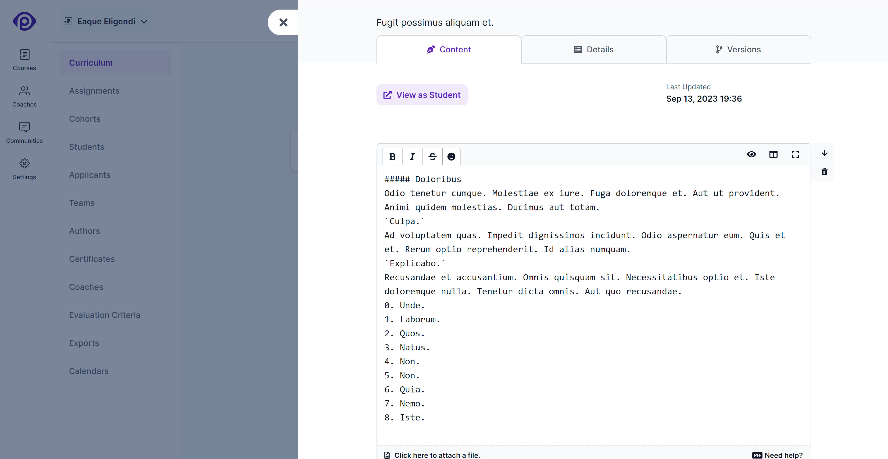
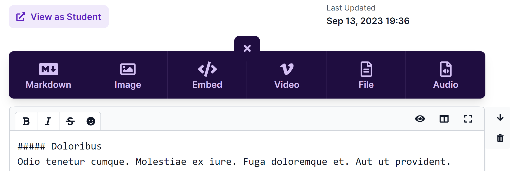
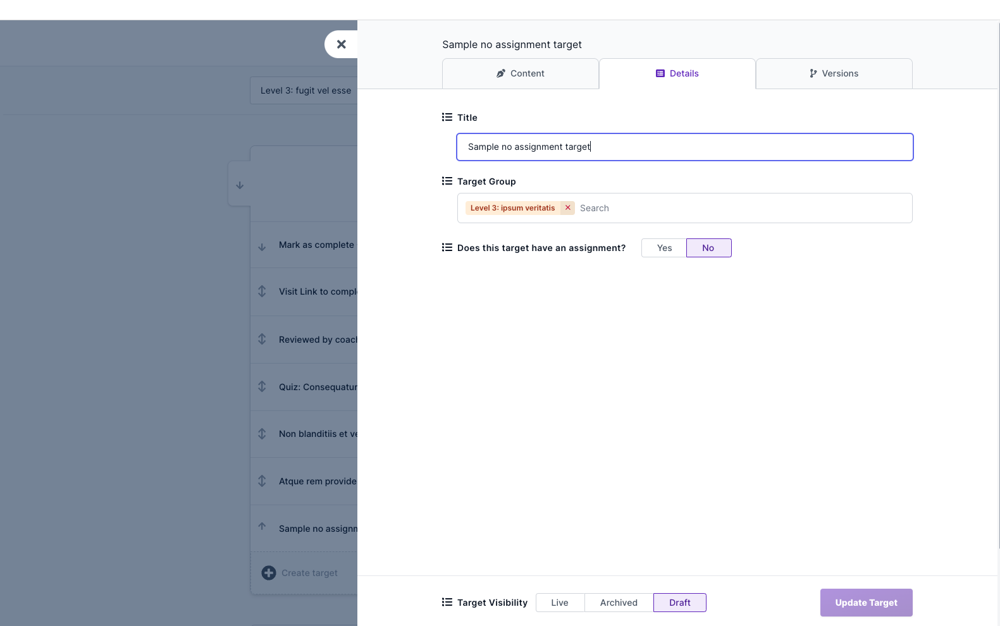
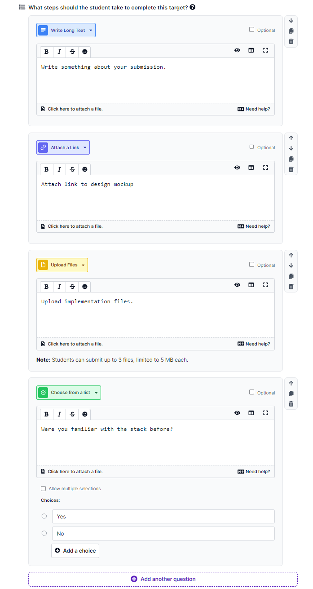
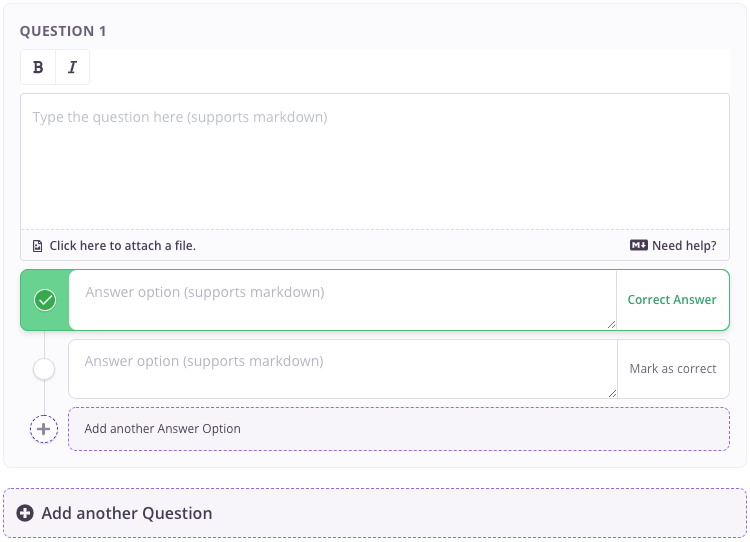

At Pupilfirst, we believe that actions speak louder than words, and that (when possible) it's always better to give your students things to _do_, rather than information to simply _consume_.

However, your students will always need instruction before they can effectively take any action. These instructions will need to be laid out in a path whose route is clear, and with a visible end-point. The curriculum editor is designed to make this possible.

The curriculum editor organizes content into _levels_, which contains many _groups_ of _targets_, each of which can hold the text and other rich media that you want your students to see.

## What are levels?

Levels are the top organizational unit within a course for organising content.

1. Levels can hold many _groups_ of targets.
2. All students begin the course content in the first level - **Level 1**.
3. Courses can have any number of levels, but you probably don't want to go overboard.

To create a new level, click the _Create Level_ button next to the level selector, and to edit a level's name, click the _edit icon_ next to the selected level. Levels have one additional property: a date to _Unlock level on_. If set, the _content_ of the level is hidden from students until that date. Coaches in a course, and all school admins will still have access to the content of locked levels.

  
What purpose does a level's <em>unlock date</em> serve?

  

    Locked levels are still visible to a student, but its content (targets) are not. This can be used to communicate to the student about the <em>path</em> they're expected to follow, but to deliberately hide the exact content they'll get access to. For example, this can be useful if the content for a level is still a work-in-progress, but the overall organization of the course is fixed.
  

### Level actions

In addition to editing the name of the level and its unlock date, you can switch to the _Actions_ tab wherein you have the possibility to merge the current level to another level. Please note that merging levels will move all the students and targets from the current level to the level you are merging into.

## What's a target group?

Similar targets can be grouped together into target groups. This allow you to organize content into discrete chunks in a way that makes sense for what you're trying to teach. To create a target group, just click the _Create a target group_ button within a level.

The editor for a target group also allows you to change the level it belongs to and to archive it. Archiving will have a target group along with its targets removed from the student curriculum.

## Creating targets

To create a target, click the _Create a target_ option inside a target group, enter a name, and hit the _Create_ button. This will create a new target with that name in the target group, and will set it to the _Draft_ status.

## Editing target content

After creating a target, you can click on it in the curriculum to open the target editor, which has three tabs: _Content_, _Details_ and _Versions_.

Clicking on a target will open the _Content_ tab by default, which allows you to edit the content of the target - this the _body_ of the material that you would like your student to read or watch.

You'll notice that the content is made up of different types of _content blocks_. If you hover over the region between any of the existing blocks, you'll find an option to insert a new content block into that space. There will always be a content block picker visible at the bottom of the existing content.

### Content block types

At the moment, we support four types of content blocks.

**Markdown** 
The Markdown block allows you to write formatted text in the Markdown format. You can also embed files and images directly into the text using the file upload feature here, but you'll have no control over how they're displayed. Images will be centered, and displayed at actual size, whereas files will be inserted as links. Use the _Image_ and _File_ block types for greater control over these kinds of content.

To see a live preview of the content you're creating in the editor, choose the split-screen option at the top-right of the editor, and it'll switch to a full-screen mode that shows the content you're writing on the left, with its preview on the right.

If you're unfamiliar with the Markdown format, or to brush up on how to use Markdown to quickly and effectively format text, click on the _Need help?_ link at the bottom right of the editor. It'll take you to documentation served within the platform which details everything you can do with Markdown.

**Image** 
The image block accepts an image file and a caption and displays it, centered with the other content. You can also customize the width of the displayed image by hovering over the image and choosing one of the available options.

**Embed** 
The embed function allows you to embed content from third-party websites - all you need to do is supply the full link of the resource that you're trying to embed, and it'll get converted into its embedded format automatically.

Currently supported web services:

- YouTube
- Slideshare
- Vimeo
- Google (Docs, Slides, Spreadsheets, Forms)
- Scribehow

If there's a specific website you'd like us to include, [please let us know](mailto:support@pupilfirst.com). We can include any well-known service that supports the Open Embed (oEmbed) standard, or if it supports being embedded using an `iframe` tag.

**File** 
The file block accepts the file and a caption and displays it as a distinctly styled block in the content of the target.

**Audio** 
The audio block accepts an audio file and uses the default browser player to play the uploaded audio in the content of the target.

## Editing a target's other details

The _Details_ tab can be accessed by clicking on the tab once the editor is open, or by clicking the _details icon_ on each of the listed targets.

This tab contains other basic details and configuration for the target, such as its name, whether it has an assignment, its completion method, and its visibility to the student and other course authors.

### Does this target have an assignment?

If you would like the student to perform an action of some kind after going through the content of the target, you can set up an assignment.

Having an assignment means a student has to _complete_ the assignment - by taking a quiz, or submitting a customized form.

If you want the target to just show information from the content tab to the student, then you can answer _"No"_ to this question.

### Assignment details

If you choose _"Yes"_ to the above question, then all the options for an assignment will become visible.

#### Setting assignment as a milestone

You can set an assignment as a milestone by select _Yes_ against the setting question. This will make the assignment a milestone assignment, which means that that the student cannot complete the course without completing this assignment. If a course has multiple milestone assignment, the student can complete the course only after completing all the milestone assignments. Milestone assignments control a student's progression in the course.

If an assignment is marked as milestone, it will be shown in the curriculum with a special milestone icon. The same will be reflected in courses curriculum page for students.

  
What happens if I don't mark any assignment as milestone?

  

    If a course doesn't contain at least one milestone assignment, there will be no way to track student progress in the course. A student can check their progress by keeping track of the number of milestones they have completed. Similarly, coaches track the progress of a cohort by keeping track of the number of milestones completed by the students.
  

  
What if I want my students to complete every assignment? Do I have to mark all assignments as milestones?

  

    

      Not necessarily. Remember that you can set assignments as prerequisites for others. Technically, you can set up a chain of assignments, one depending on the completion of another to ensure that students complete all targets.
    

    

      How you organize the content is ultimately up to you. We've deliberately made content organization flexible because the way you organize content will depend on the nature of the content, and in what order (if any) you want students to tackle your material.
    

  

#### Setting the method of completion

To decide how a student can complete an assignment, this interface asks you a few questions:

**Does this assignment have any prerequisites?** 
You can select other assignment from the course as prerequisite assignments. This will _lock_ the assignment until the student made a submission for reviewed prerequisite assignments and completes the non reviewed prerequisite assignments.

There are 3 other scenarios in which an assignment can be locked:

1. The student has submissions queued for review with count greater than the progression limit set for the course. This is only applicable to assignments that are reviewable.
2. The student's [access to the course](/users/students#editing-student-details) has ended, because of which they have read-only access to the course content.
3. The course's [end date](/users/courses#creating-courses) has passed, because of which students have read-only access to the course content.

**Will a coach review submissions on this assignment?** 
If you would like a coach to review a submission from a student - pick _Yes_ here. If you'd like the student to complete the assignment on their own, pick _No_.

**Choose evaluation criteria from your list** 
This list will appear only if you've chosen to have the assignment's submission reviewed by a coach. Pick at least one evaluation criteria that the coach should use when reviewing submissions from students for this assignment.

**How do you want the student to complete the assignment?** 
If you answered _No_ to whether a coach will review submissions for this assignment, then you'll need to pick one of 2 ways by which a student can complete the assignment on their own:

1. Take a quiz to complete the assignment: You'll need to prepare a quiz - the process for this is detailed below.
2. Submit a form to complete the assignment: You'll need to prepare a form with questions - the process for this is detailed below.

**How should teams tackle this assignment?** 
If you have students grouped into teams, then you'll probably have some assignments that you'd like them to tackle together. When creating a new target, this setting will default to _All students must submit individually_, which means that each student will need to submit on their own. If it's a reviewed assignment, then all students in the team will need to pass the assignment individually.

For those assignments where you expect students to work together and submit as a _unit_, you can choose the _Only one student in a team needs to submit_ option. Now, if any student in a team submits work on the assignment, the submission will be credited to all students in the team. If work on the assignment is reviewed by a coach, then the name of all students in the team will be listed next to the submission, and any feedback on the submission will be sent to all linked students.

**Do you have any completion instructions for the student?** 
Text entered here will be displayed right next to where the students take action on a target. This will be at the top of the page that displays the quiz, or the submission form.

#### Do you want to enable discussion on this assignment?

To foster an interactive learning environment where students can view and engage in discussions on their peers' submissions, respond to _Yes_ the prompt _Do you want to enable discussion on this assignment?_. Selecting _Yes_ will activate the discussion feature, [allowing students to participate in discussions](/users/taking_courses#submissions-by-peers). Choose _No_ (default) if you prefer to keep submissions private. For further details on utilizing the discussion feature, please refer to the linked guide

#### Setup submission anonymity

Upon enabling discussions for student submissions, you have the option to permit anonymous submissions. This setting empowers students to submit their assignments without revealing their identities; their names will remain concealed from peers within the discussion section. To activate this feature, simply select the option to allow students to submit anonymously.

#### Defining steps to complete an assignment

For assignments that require students to submit work for review, you can define the steps that a student needs to take to submit their work.

Each step needs to have a _title_ and an _action type_. Together, they define how a student completes the step. The _title_ is generally used to give a short description of what's expected from the student to complete the step. These are different possible action types:

1. **Write Long Text:** Allows the student to write paragraphs of text.
2. **Write Short Text:** Allows the student to write a single line of text.
3. **Attach a Link:** Allows the student to attach a single URL.
4. **Upload Files:** Allows the student to attach files to complete the step. Up to 3 files can be attached such a step (max 5 MB, each).
5. **Choose from a list:** Student is shown a list of choices, from which they can pick one; you decide what the choices are. This now supports multiple selections you can configure it by checking the _Allow multiple selections_ checkbox.
6. **Record Audio:** Allows student to record an audio with a size limit of 5MB

Here's an example assignment consisting, of four steps to complete the assignment:

Apart from _title_ and _action type_, you can make any step _optional_. Optional steps can be skipped by students when making a submission.

You can also change the order of steps, remove a particular step, or even duplicate an existing step using the control icons that are available to the right of each step.

Here are some other points to keep in mind:

1. The maximum number of steps allowed in an assignment is 25.
2. You are allowed to create an evaluated assignment without any steps. However, this would mean that a student can _submit_ work on an assignment without actually providing any information. This would still require the coach to review an empty submission. This option can be used for cases where the work in question is done _outside_ of the platform and is known to the coach.

Once all steps are defined, students can submit the assignment by executing the required steps and a coach gets to see the response from students for each step.

Here's an example of how an assignments steps are shown in the student submission interface and in the coach review interface:

#### Preparing a quiz

If you opted to let the student answer a quiz to complete the assignment, then you'll need to prepare one:

1. The quiz supports Markdown in both questions and answers.
2. Every question must have at least two options.
3. You can have any number of questions.

#### Preparing a form

If you opted to let the student submit a form to complete the assignment, then you'll need to prepare one:

This form creation process is similar to `Defining steps to complete an assignment` process. You can add questions to the form and define the action type for each question. This form creation supports all the action types that are supported in `Defining steps to complete an assignment` process.

The form should have at least one question and the maximum number of questions allowed in a form is 25.

### Target visibility

You'll find the _visibility_ setting at the very end of step 2. This setting has three options:

1. **Live:** Target will be visible to students.
2. **Draft:** Target will be visible only within the curriculum editor.
3. **Archived:** Target will be hidden. You can still access it through the _Show Archived_ button at the top-right of the curriculum editor interface. It'll appear only if you have archived targets in the selected level.

## Target content versions

The third tab of the target editor is called _Versions_. Just like the _Details_ tab, _Versions_ can be accessed by clicking on the tab once the editor is open, or by clicking the versions icon on each of the listed targets.

This tab shows you a preview of a target's content as it appears now to the student. But more importantly, it allows you to save the current state of the content as a version, browse previous versions to see how the target's content looked earlier, and restore an old version.

When a target is first created, you're assumed to be working on its first version. Once you've worked on the target's content for a while, and are happy with it's state, the _Versions_ tab will allow you to _save that version_. Saving a version will create a new version which will hold future changes.

  
What exactly is a <em>version</em>?

  

    

      A version can be thought of as a <em>snapshot</em> of a target's content as it looked at the time it was taken. However, you're always working on the <em>current</em> version of the target, so that can always be changed an author. You'll need to take a <em>snapshot</em> manually on the versions tab for a new version to be created. As the author of a target, you're the best person to decide when it's appropriate to preserve a version.
    

    

      This feature allows you to preserve a <em>known good state</em> for a target's content, and since you can browse previous versions of a target, it can help track changes to the content, or even act as a safeguard, by allowing you to <em>restore a previous version</em> if something goes awry during the editing process.
    

  

## GitHub Actions

You can use GitHub Actions to automate testing and reviewing student submissions for a target. When you configure the Github Actions for a target, Pupilfirst LMS will automatically create a repository for the student and add the Github Actions workflow along with the student's submission.

In the "Edit Target Action" page, you can add a GitHub Action workflow that suits your needs. This workflow will be added to the student's repository automatically upon submission.
A new branch will be created for each submission, allowing for isolated testing and review. The actions history can be accessed through the submission review interface where you can also re-run actions.

We have also created a few actions wrapping our API's that you directly use on your workflow file to automate the testing and reviewing process. These actions are:

1. [Check Repo Action](https://github.com/pupilfirst/check-repo-action): Use this action when a student's submission includes a URL to a GitHub repository. It clones the repository and checks for the presence of required files or folders, ensuring that the submission is complete.
2. [Report Action](https://github.com/pupilfirst/report-action): This action reports the test running status back to the LMS, enabling easy tracking of student progress and performance.
3. [Grade Action](https://github.com/pupilfirst/grade-action): This action grades student submissions based on predefined criteria or test outcomes, offering a standardized and automated evaluation process.

You can also find a workflows that we are currently using for our courses at [Test Scripts Repo](https://github.com/pupilfirst/vta-test-scripts)
