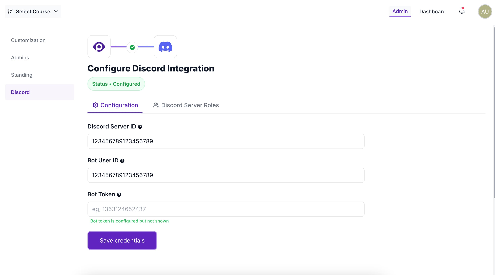
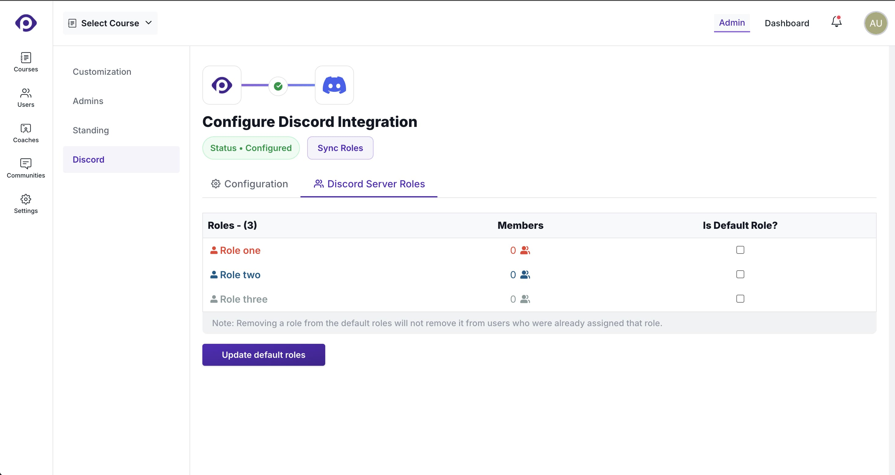

Pupilfirst LMS support integration with Discord to automatically onboard your students to a Discord community, along with managing Discord server role assignment based on their membership to cohorts, or on a per-user basis.

## Setup

To set up the Discord integration, [create a Discord app](https://discord.com/developers/docs/quick-start/getting-started) with includes the `bot` scope, and assigns the following permissions:

- Create Instant Invite
- Create Public Threads
- Manage Nicknames
- Manage Roles
- Send Messages
- Send Messages in Threads
- View Channels

Once the Discord application has been created, visit the _Configure Discord Integration_ page to fill in values associated with the Discord server and the bot user.

After you've saved the credentials, you should visit the _Discord Server Roles_ tab and _Sync Roles_ to fetch all Discord server roles that the bot is allowed to assign.

Remember to sync roles at the LMS after you've made changes to roles on the Discord server.

## Default roles

One or more of the available roles can be assigned as _default roles_. These default roles will be assigned to all LMS users who connect their Discord account and join your server. This feature can be used to assign _base roles_ which assign a minimum set of permissions (such as access to common channels) to all your users.
