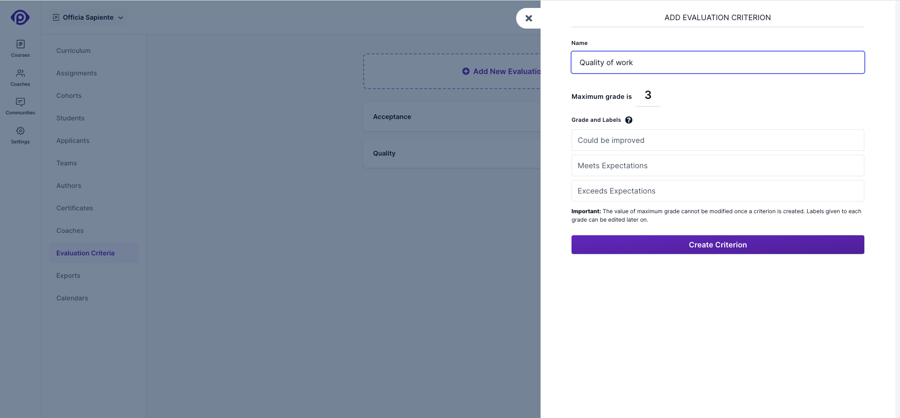

Evaluation criteria form the basis by which coaches evaluate a student submission for a target. An evaluation criterion has a maximum grade and labels for each grade. Targets can be linked to multiple evaluation criteria, and coaches need to grade a student submission
for a target for each of these criteria.

## Adding and Editing Evaluation Criterion

To create a new evaluation criterion, visit the _Evaluation Criteria_ sub-menu within a course, and click the _Add new evaluation criterion_ button.

**Name**: The name of the evaluation criterion, which will be displayed in the coach review interface and student grade card.

**Maximum grade**: The maximum grade for the evaluation criterion. The allowed values range from 2 to 10.

**Grade and Labels**: This interface allows admin to create a label for each of the grade values. These labels appear both in the student grade card and the review interface for coaches. If grades are not assigned any labels, the labels default to the text version of the grade, as one, two, three, etc.

The value for maximum grade cannot be modified once a criterion is created. Labels given to each grade can be edited later on.

An example of grade labels in a student grade card is as shown below:

The student submission here received a grade of 2 for evaluation criterion with name _Quality of work_.

Here's how grading based on multiple criteria looks in the coach's review interface. The target here is graded on two criteria, each of which has it's own grading scale.

