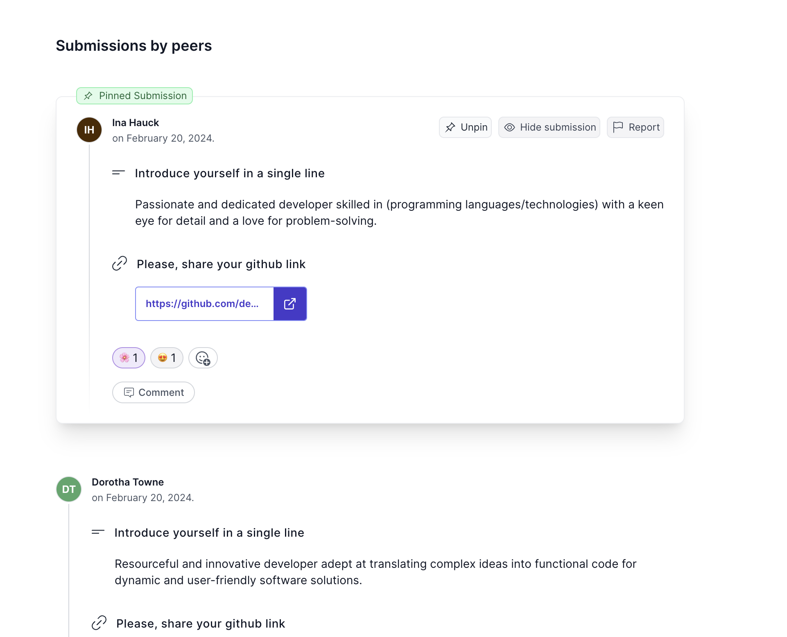
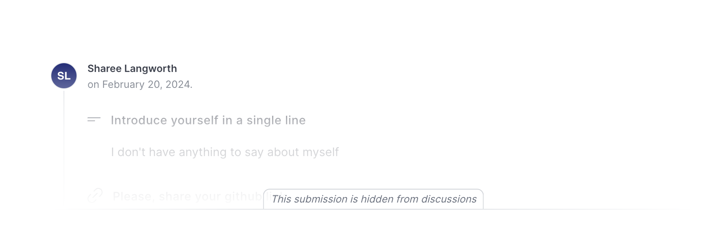

If a target [has discussion enabled](/users/curriculum_editor#enable-discussion), then students will be able to [see submissions for that assignment from all other students](/users/taking_courses#submissions-by-peers) in the course. The _Discussion_ feature allows students to view, comment on, react to their peers' submissions. To monitor discussion activity, coaches, school administrators and course authors can take some additional *moderator* actions on public posts.

## Pin exceptional submissions

Enhance visibility for exemplary submissions by pinning them to the top of the _Submissions by Peers_ section. This feature allows you to highlight outstanding work as a model for other students. You have the flexibility to pin multiple submissions; these will be displayed sequentially at the top, ensuring prominent visibility to all students.

## Managing visibility of submissions and comments

Ensure a healthy community environment by concealing any submissions or comments you deem inappropriate. Once hidden, these items will be invisible to students but remain accessible to coaches, course authors, and school administrators. Should you decide an item is once again suitable for student viewing, you can easily restore its visibility at any time.

