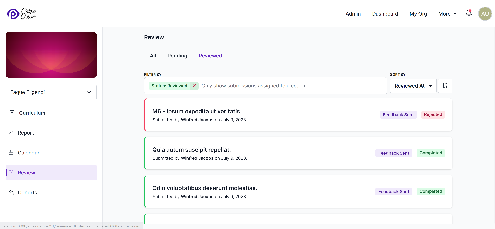
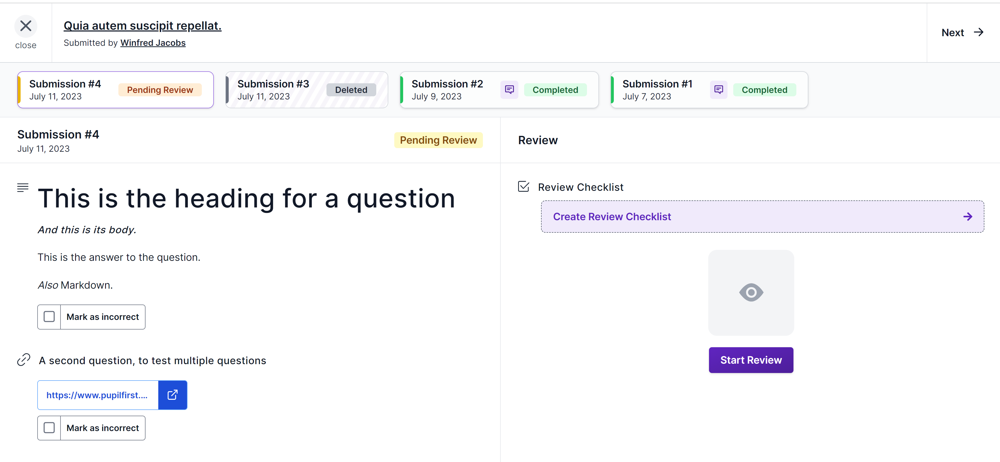
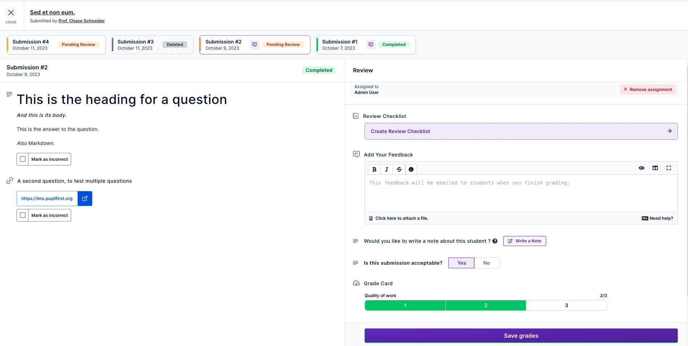
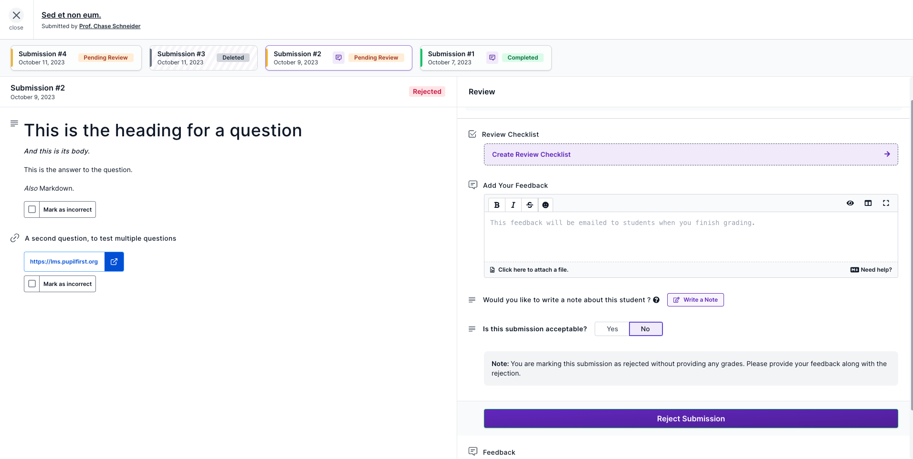
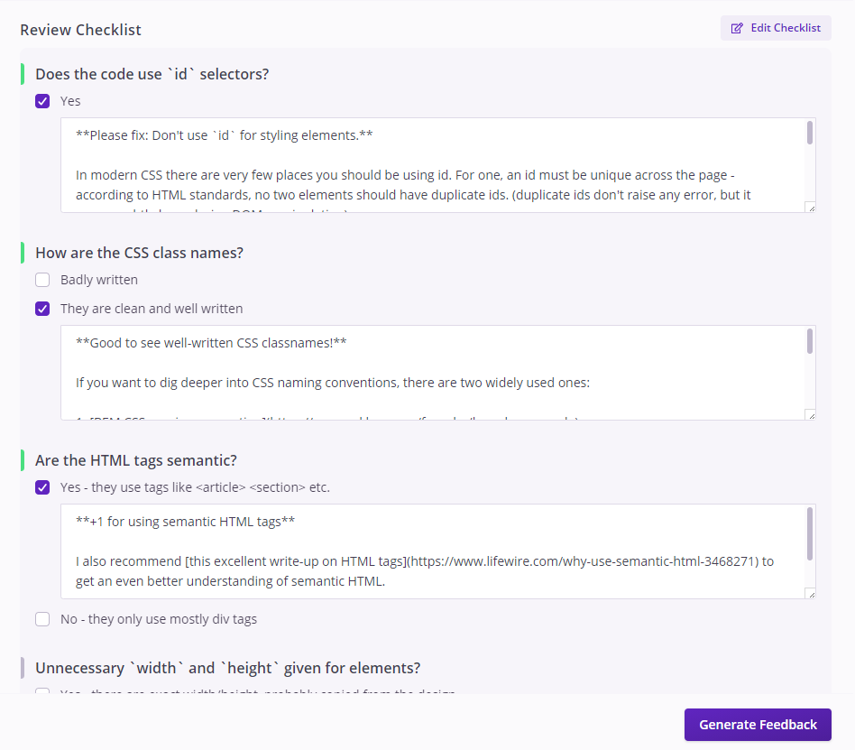

When targets are completed by a review from a coach, student submissions first appear in the a coach's _Review_ tab. This is accessible from the `/dashboard` page, and when loaded, it shows submissions of students from all cohorts that the coach has been assigned to in a course.

School admins can view all student submissions, but cannot grade them or give feedback unless they have been enrolled in that cohort as a coach.

## Submissions for review

This page has three tabs: _All_, _Pending_ and _Reviewed_, with submissions that are pending review kept in the pending tab. The _Reviewed_ tab holds a list of submissions that have already been reviewed.

Clicking on a submission opens up the submission for review.

## Submission Details

When a submission is clicked, it opens up to display everything that the student included as a part of the submission along with an option to review it. This page also includes every other submission from the student for the _same_ target.

  
Why are other submissions for the target listed here?

  

    Because students can make multiple submissions to improve their grade on a target, it makes sense to see previous submissions for the target in the same place. This allows coach to easily and quickly check for improvement from their prior work.
  

## Reviewing Submissions

Reviewing a submission involves going over the work that the student has submitted and firstly to decide whether its acceptable or not and if acceptable assigning it grades on each of its evaluation criteria.

There's quite a bit to unpack here, so we'll go over each element one by one.

### Rejecting a submission

The first decision a coach has to make is whether the submission is acceptable or not. You can mark this by choosing Yes or No to the question _Is this submission acceptable?_
If you choose No then, you would have the option to reject the submission by clicking _Reject Submission_.

This means the student has failed the submission and they're _expected_ to re-submit the assignment till it is accepted. If the assignment in question is a milestone, or is a prerequisite for another, this can cause other targets to become locked and block a student's progression in the course until they get the submission accepted.

If you choose Yes then the option to grade the submission will be shown which we will discuss next.

### Grade Card

If a submission is acceptable then the coach must assign grades for all evaluation criteria on a target. In the example screenshot above, there is only one criteria, but targets can have any number of these. Depending on how the grading for the course is set up, a coach can assign any of these grades to a submission.

Once a grade has been assigned for all evaluation criteria, a coach can save the grading. The submission will then be removed from the _Pending_ list in the previous page.

However, there is more that a coach can do besides assigning grades.

### Marking Submission Items as Incorrect

This is an optional step, where a coach can mark any particular submission items from a student as incorrect. A student submits a target by executing a series of [steps defined for the particular target](/users/curriculum_editor#defining-steps-to-complete-a-target). A coach can mark a particular item as incorrect using the _Mark as incorrect_ checkbox beside each item. Along with the feedback, this gives an opportunity for the coach to clearly indicate where the student needs to improve upon.

### Adding Feedback

For students, a lot of the value of a difficult course comes from the in-depth and targeted feedback that you, as an expert in your field, can deliver when you look at their work. So when you're reviewing submissions, if you have something to _tell_ the student, then you should use the _Add Your Feedback_ option.

It's a _Markdown_ field where you can type your feedback for a student, and it'll be emailed along with the grade report. You can also send feedback _after_ grading a submission.

Over the course of using Pupilfirst ourselves, we've learned that reviewing submissions can be time-consuming, and that a lot of the work can be repetitive. If you notice this happening to you, then we'd suggest that you use the _Review Checklist_ feature that was built to speed up the review process.

### Review Checklist

As the name suggests, this feature allows you to create a checklist for your review process. What's interesting here is that you can couple your checklist with feedback that is appropriate to the result of your check.

Over the course of reviewing many student submissions, it's very likely that you'll see a pattern to the mistakes that students make, so it can be quite useful to store generic versions of feedback for the results from your checklist, and use that as a template to prepare feedback for a submission. Of course, you can always edit and personalize the feedback before you send it to your student.

You can also revise the template over time, as your understanding of student's issues improves. This can also be really helpful if you're working with other coaches, all of whom can edit the checklist, letting your _collective_ knowledge improve the quality of the feedback.

## Leaving Notes

You can write down notes about a student while you're reviewing a submission. These [notes will be stored in a student's report](/users/reviewing_submissions#leaving-notes), and can be viewed only by you and other coaches.

If the submission you're leaving a note on is from a _team_, then the note will be posted to the report of all students in that team.

  
Do you have any feedback about this process? We'd love to know!

  

    The greater the difficultly of a course, the greater the importance of a good review process and targeted feedback. As always, if your experience as a teacher has shown you new approaches or techniques, our team at Pupilfirst would be more than happy to <a href="mailto:support@pupilfirst.com">have a conversation about it</a>.
  

