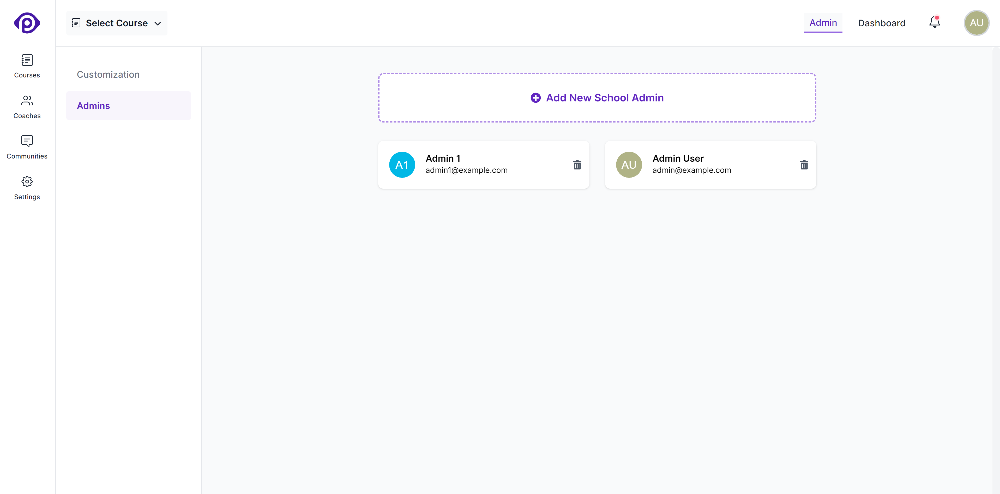

As an admin of a school, you can invite others to share the work in managing the school. You can edit the list of admins from the _Admins_ sub-menu in the school's _Settings_ section.

## Adding new admins

To add a new admin, click the _Add New School Admin_ button, fill in the name and email address for the admin and click the _Create School Admin_ button. That's it.

## Removing admins

As an admin, you can remove other admins from the school, and even your own admin access. However, a school must have at least one admin. So if you're the last admin left in a school, you cannot remove your admin access.
