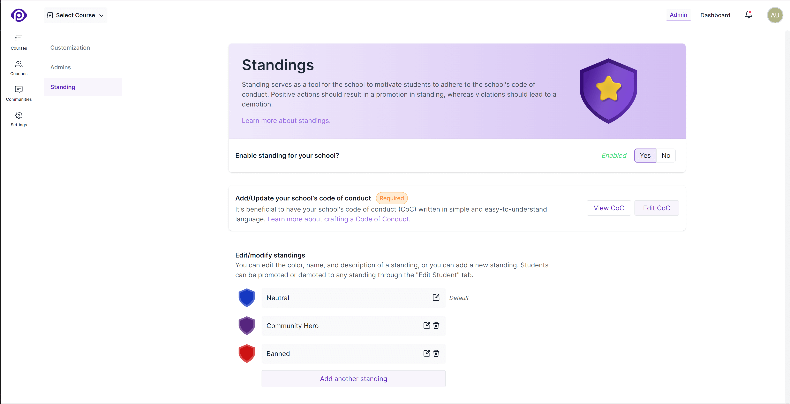
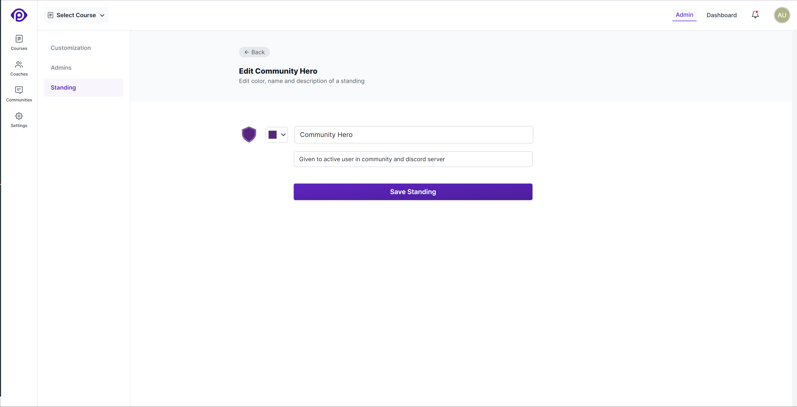

Standing serves as a tool to communicate to students their standing with regards to the school's Code of Conduct. Positive actions such as submitting assignments early, active participation in the community, etc. could be rewarded with positive standing. Negative actions such as plagiarizing assignments, misbehaving in the community, etc. can be penalized with negative standing.

## The things you can do from this page are:

1. **Enable/Disable Standing:** You can enable or disable standing for your school. If you disable standing, the current standing and standing log entries of all students will be hidden. You can enable standing at any time, and all standing log entries will be visible again.

2. **Add/Edit/View Code of Conduct:** You can add, edit, and view the Code of Conduct for your school. The Code of Conduct is meant to be a set of rules that students and other members of your school are expected to follow. All users of the LMS can access the Code of Conduct from their standing page, or from the link in the footer of the school website.

3. **Add/Edit/View Standings:** You can add, edit, and view the standings for your school. You can add a new standing by clicking on the `Add another standing` button. You can edit a standing by clicking on the `Edit` icon next to the standing. You can delete a standing by clicking on the `Delete` icon on the standing card.

> **Note:** When you enable the standing for your school for the first time, a default standing will be created for you. You can edit the default standing, but you cannot delete it. The default standing is used as the initial standing for all the members of your school.

The standing creation and edit form has the following fields:

- **Name:** The name of the standing. For example, `Neutral`, `Good`, `Community Hero`, `Warned`, `Disreputed` etc.

- **Description:** The description of the standing. It is optional, but we recommend that you use it to briefly describe the standing. This description will be shown to admins (in the student standing editor), students (in their standing page) and to organisation admins (when viewing student records).

- **Color:** A color picker is present to select the color of the standing. This color will be used to display the standing shield and standing name across the platform. For example, `Banned` standing can be red. If you do not select a color, the color picker will use a default color.

> **Note:** Use different colors for different standings to make it easier for users to identify their standing.
