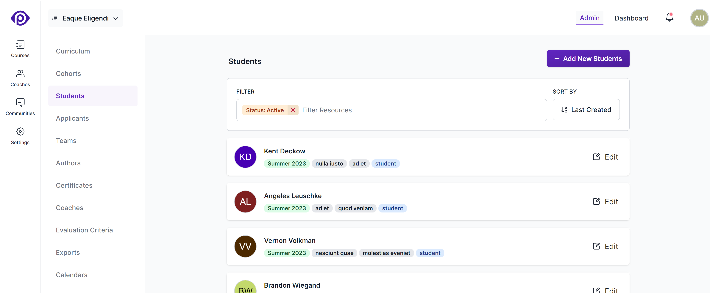
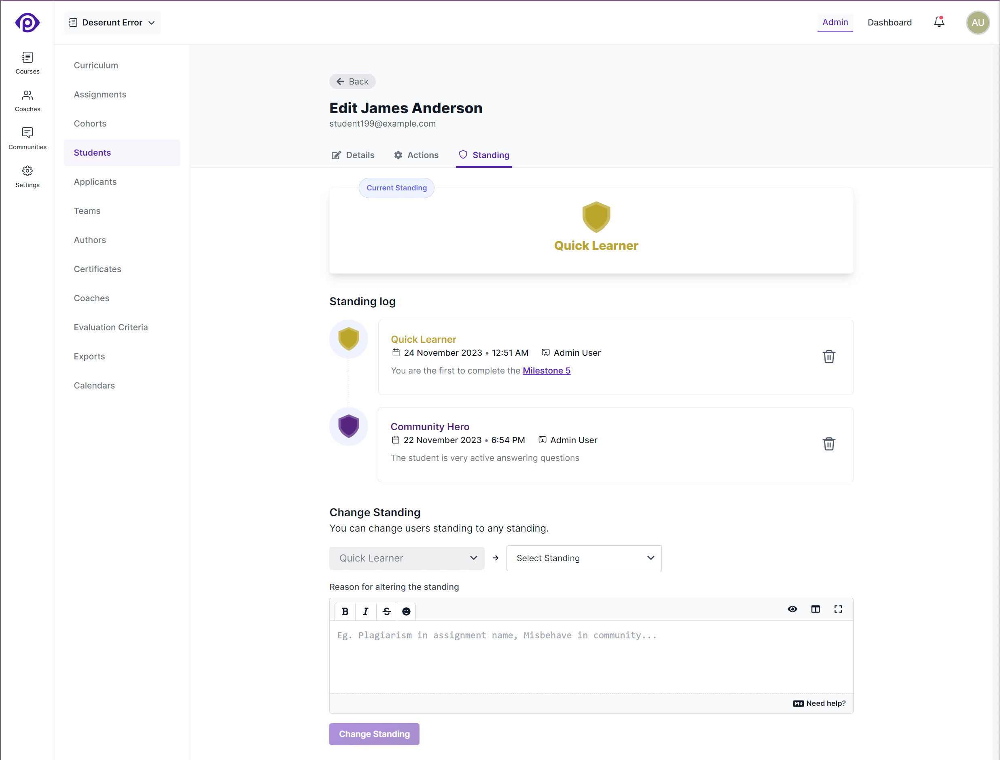
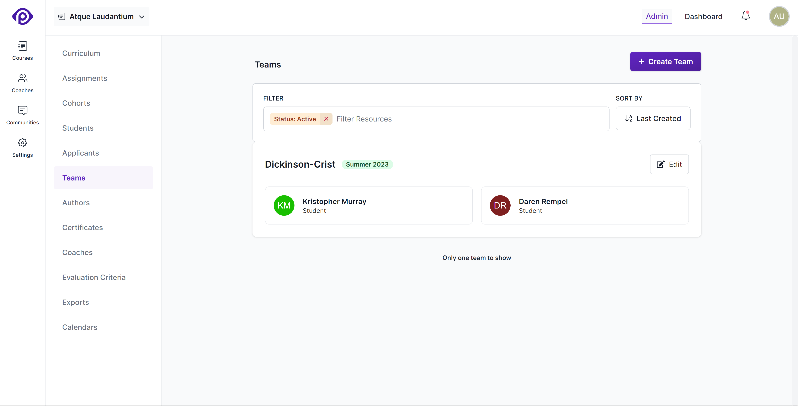
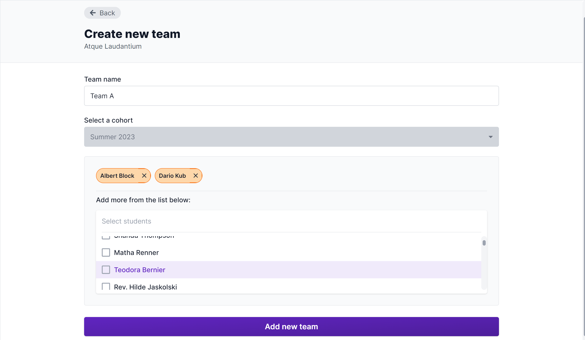

Courses can contain any number of students and cohorts. To see the students in a course, first select the course from the main admin navigation bar, or click the _Edit Curriculum_ link if you're on the _Courses_ menu. Then pick the _Students_ option from the course's sub-menu.

## Adding new students

To add new students to a course, click the _Add New Students_ button at the top-right of the list. The form that opens up will allow you to add many students at once. It asks for the following details:

**Select a cohort**: Select a cohort from the _Pick a Cohort_ dropdown list.

**Name**: The name of the student.

**Email**: The email address that the student will use to log into your school.

**Title**: The title of the student. Feel free to leave this blank - it'll default to _Student_.

**Affiliation**: The organization to which the student belongs. This field is also optional.

The _title_ and _affiliation_ fields are used across the platform to better identify students.

**Team Name**: If you're adding a student to a team, you can enter the team's name here. If you're not adding the student to a team, leave this field blank.

Students with same team name will be grouped together; this will not affect existing teams in the course.

**Tags**: Tags are keywords or strings to associate with the list of students that you're adding, and can be used to quickly filter the list of students in a course. You can start typing and pick from the suggested list of tags or create new ones.

**Notify students**: Use this checkbox to enable or disable onboarding email notification for the newly added students.

### Add multiple students at once

1. Fill in the details of the first student, and click the _Add to List_ button.
2. This will add the first student to a list that is unsaved, and preserve the _Cohort_, _Title_, _Affiliation_, and _Tags_, so that you can add more students to the list.
3. Once you're okay with the list of students to be added, click the _Save List_ button. It'll add everyone you've listed as students in the course, together.

## Editing student details

To edit a student's details, click on the student's name. You'll see all of the fields you entered in the creation form, and one additional field:

**Personal Coaches**: This list allows you to [directly assign coaches](/users/coaches#assigning-coaches-to-students) to a student, which will allow coaches to filter submissions to review by the students they've been assigned to.

## Student actions

In addition to editing a student's details, you can switch to the _Actions_ tab which lists the actions that you can take on a student:

**Course Certificates** 
This will list all the certificates that the student has earned in the course. You can view each certificate by clicking on the certificate ID. You can issue a certificate from here and also revoke a certificate if needed.

**Has this student dropped out?** 
If you click the _Dropout Student_ button, the student will lose _all_ access to the course. Unlike students whose access to a course ended on a certain date, students who are marked as dropped out will not be able to access course content, or their own work within a course. The course will still be displayed on their dashboard page (marked as _Dropped Out_), but they will not be able to access its curriculum.

## Inactive students

Students whose access to a course has ended by being part of ended cohort or who were marked as dropped out will be hidden from the main list of (active) students. To see these inactive students, select the _ended_ and _dropped_ status filter from the filter at the top of the students page.

Inactive students can be reactivated by moving to a cohort that is not ended or reactivating a dropped out student from the _Actions_ tab.

## Student Standing

Pupilfirst allows you to reward students for positive actions and penalize them for negative actions. This is done through a feature called [Standing](/users/school_standing).

The standing page contains the following information:

1. **Current Standing:** This section displays the current standing of the student with a standing shield and standing name, along with the color of standing.

2. **Standing Logs:** This section displays the standing logs of students. Each standing log is displayed as a card with the following information:

   - The standing shield styled with color of the standing.
   - The standing name styled with color of the standing.
   - The details of the standing log entry.
   - The date and time when the standing log was created.
   - The name of the user who created the standing log.

3. **Add Standing Log:** This section allows you to add a new standing log for the student. The `change standing` section has the following elements:
   - A dropdown to select a standing from the list of available standings.
   - A markdown editor to type in the details of the entry in the log.
   - A button add an entry to the standing log and to optionally change the standing of the student.

## Teaming up students

Students don't have to go through a course alone. Pupilfirst allows you to create teams of students who progress through a course _together_.

1. Teams have a _name_ that identifies the group.
2. Students in a team can go through the course together.
3. Students can work on certain assignments together.

### Adding students to a team

To group two or more students as a team, head to the _Teams_ sub-menu within a course, then click the _Create Team_` button at the top-right of the page. The form that opens up will allow you to add teams. It asks for the following details:

**Team Name**: The name of the team. This is a required field.

**Select a cohort**: Select the cohort from the dropdown list. After selection, you'll see the list of students who are part of the selected cohort.

**Select students**: Select the students from the multi-select dropdown list. You will see students who are not part of any team in the list.

When students are displayed anywhere in the interface, they'll always be grouped together with their team.

  
How do I set it up so that students in a team submit work on a assignment together?

  

    When editing the details of a target, you are asked the question <em><a href="/users/curriculum_editor#setting-the-method-of-completion">How should teams tackle this assignment?</a></em>
  

### Editing a team

To edit a team's details, click on the edit on the respective team from the teams index page. You'll see all the fields you entered in the creation form. You can add or remove students from the team.

### Actions on a team

In addition to editing a team's details, you can switch to the _Actions_ tab to delete a team. Deleting a team will not delete the students in the team. They will be moved out of the team and will be available in the list of students.

### Removing a student from a team

You can move individual students _out_ of a team by selecting just one and using the _Move out from Team_ option.

## Importing students in bulk

To add new students in bulk to a course, click the _Bulk Import_ button at the top right of the list. The form that opens up allows you to a select a CSV file with list of students to be onboarded to the course. You can use the [template file](/files/student_import_sample.csv ":ignore") available in the form to list the students with required details. Refer to [add new students form](/users/students#adding-new-students) for details on each field. Here are a few ground rules for the data that you populate in the import sheet:

1. Name and email are mandatory columns and should have valid data. Name can have a maximum of 250 characters.
2. Title, affiliation and tags are optional similar to the [add new students form](/users/students#adding-new-students). A maximum of five tags are allowed per student and should have a character limit of 50. Title and affiliation, each has a character limit of 250.
3. Team name is optional and should be only used if you need to club students as a team. If more than one student is assigned the same team name in the sheet, they will be teamed up together. Team name has a character limit of 50.
4. A maximum of 1000 students are allowed to be imported at once using the bulk uploader.

The errors in the sheet will appear in the form once you upload a CSV file, which will guide you to easily fix them. Once you have a totally error free sheet, use the _Import Students_ button to initiate the bulk onboarding process. On successful completion, you will receive an email confirming the same.

Similar to [add new students form](#adding-new-students), use the notification checkbox above the _Import Students_ button to enable/disable onboarding email notification for newly added students.
