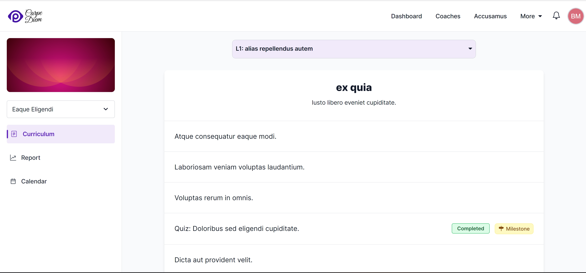
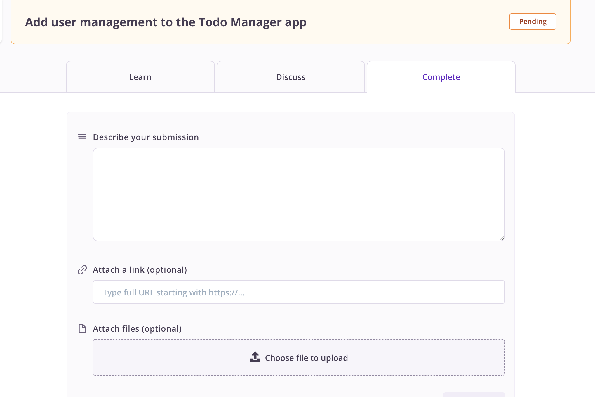
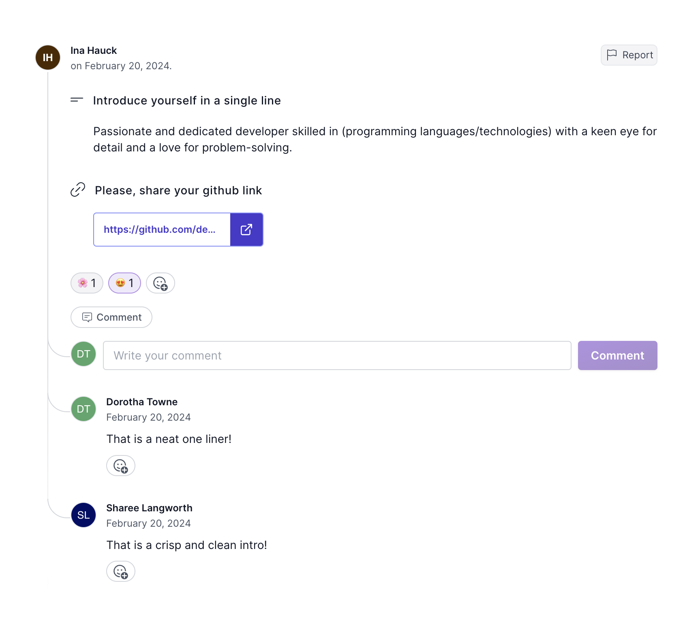
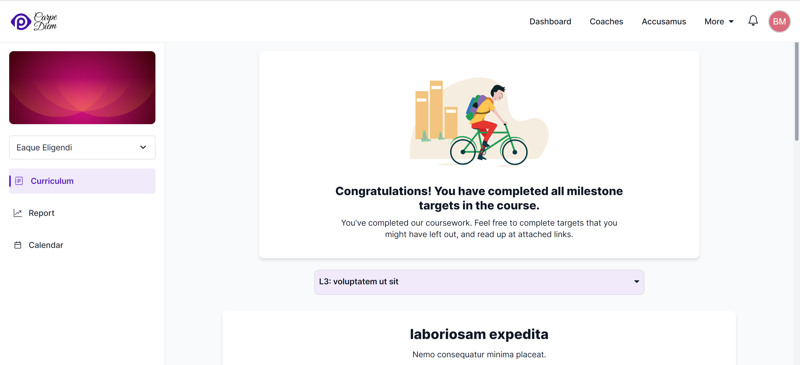

All students begin a course in its first level and progress by going through targets and completing milestone assignments.

Specifically, they need to complete all [milestone assignments](/users/curriculum_editor#does-this-target-have-an-assignment). A course is deemed to be completed when all of its milestones have been completed. Levels are a way to organize the content of a course and progression is measured only through the completion of milestones.

## Structure of a course

All content in the form of targets in a course are visible to students, but whether they can attempt an assignment within a target depends on the prerequisites of the assignment and the _course progression limit_ setting (the number of allowed submissions pending review by coaches).

Levels can contain optional assignments and mandatory _milestone_ assignments. Furthermore, assignments can have dependencies on each other in the form of prerequisites, which allows further customization of the order in which students attempt assignments. As an author, the structure of your content depends upon the nature of the topic you're aiming to teach.

## Completing targets & assignments

Students progress in a course by going through targets, marking them as read, and completing assignments in these targets. [As discussed in the curriculum editor](/users/curriculum_editor#setting-the-method-of-completion), where you'll be authoring courses, targets that are set up to contain an assignment can be completed in one of two ways. Of these, assignments that are configured to have submissions reviewed by coaches is the most interactive option. Here a student executes a series of steps, [as defined using the assignment editor](/users/curriculum_editor#defining-steps-to-complete-an-assignment), to submit work on an assignment for review.

Reviewed assignments are very likely to be the most valuable assignment completion method for a student. This is because it's possible for expert coaches to make a qualitative review of a student's submission and give targeted feedback that will help them the most.

This is a part of what _teachers_ do - get to know your student, what they need, and how best to help them progress from wherever they are in their learning process.

We can, and will continue to [build features to make the review process easier](/users/reviewing_submissions#review-checklist). Currently, we're in the process of developing an AI review process which can assist you in handling review workload. If you have any suggestions on how we can make improvements here, [please talk to us](mailto:support@pupilfirst.org).

## Learning from peers

If the assignment has [_Discussion_ enabled](/users/curriculum_editor#enable-discussion), then students will see a section titled _Submissions by peers_ in the same page where they author their own submissions. This section will display submissions by all other students in the course. Students can comment, and react to each submission and engage in meaningful discussion.

Students can also report a submissions or comments that they believe does not follow [the Code of Conduct](/users/crafting_code_of_conduct) of the school. This will help coaches and school administrators [moderate public discussion](/users/moderating_discussions) and maintain a healthy learning environment.

## Participating in the Community

When a community is linked to one or more courses, students in those courses can post questions in the community. In addition to this, if a community has the _Discuss Targets_ option is enabled, then students will see the _Discuss_ tab when they open targets. The tab shows questions other students have asked about the target in the past.

Because the issues that students face are often similar, having a history of doubts raised by previous students increases the likelihood that a student can immediately get answers for their doubts. For the author of a course, these questions can also be an indicator that there are aspects of the target's content that could be improved.

## Finishing a course

Students are considered to have finished a course when they've passed all _milestone_ assignments in it.

On courses with difficult subject matter, we've found it appropriate to end courses with capstone milestones that require students to exercise a wide range of skills they've learned during the course.

This allows students to _flex_ their new skills, and also provides a good opportunity to provide feedback and to guide them towards further growth.
