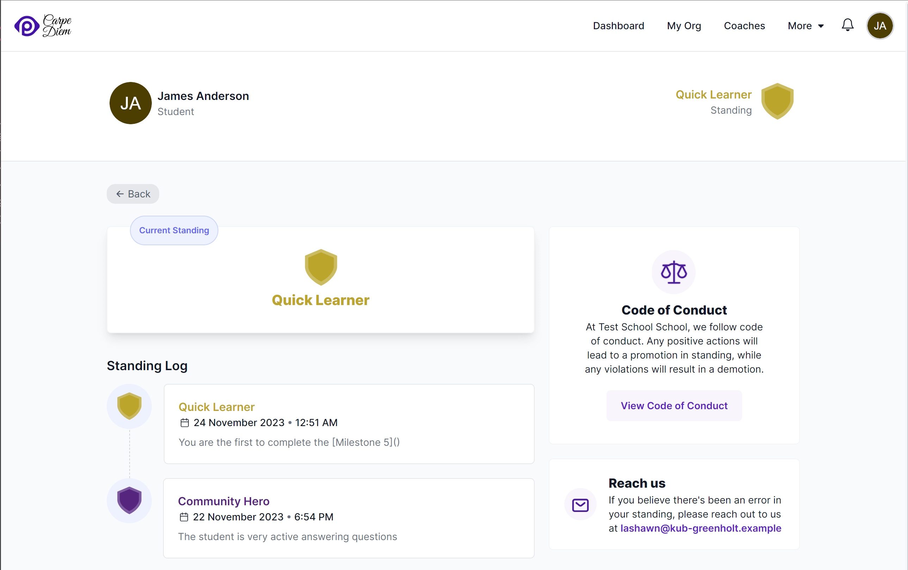

Standing is used to communicate student/user standing with respect to school's code of conduct. Positive actions such as submitting assignments early, active participation in the community, may be rewarded with positive standing. Negative actions such as plagiarizing assignments, misbehaving in the community, can result in a negative standing.

The user standing page is accessible to all users. The link to access the user standing page is present on the dashboard page.

This page contains the following information:

1. **Current Standing:** This section displays the current standing of the user, with a standing shield and a standing name styled with the color of the standing.

2. **Standing Logs:** This section displays the standing logs of the user. Each standing log is displayed as a card with the following information:

   - The standing shield styled with color of the standing.
   - The standing name styled with color of the standing.
   - The reason for change in standing.
   - The date and time when the standing log was created.
   - The name of the user who created the standing log.

3. A link to the school's code of conduct page.

4. Email to reach out if there's a question about the standing logs.
